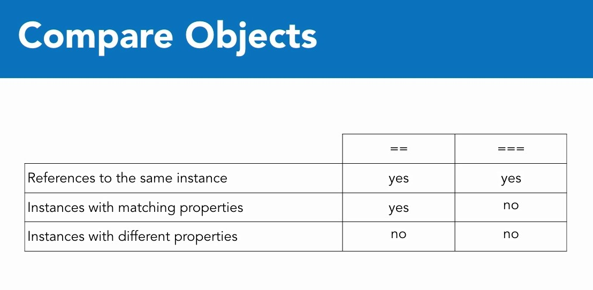

## 01 - Constructor method

https://www.php.net/manual/ru/language.oop5.magic.php

В конструкторе всегда создаётся  и возвращается объект, хотя и не указывается `new $object` и `return $object`. Между двумя этими действиями выполняется самописный код конструктора.  

constructors.php

```php
<?php

class Sofa {

  public static $instance_count = 0;

  public $seats = 3;
  public $arms = 2;

  public function __construct() {
    self::$instance_count++;
  }
}

class Couch extends Sofa {
  var $arms = 0;
}

class Loveseat extends Sofa {
  var $seats = 2;
}

$sofa = new Sofa();
echo 'Sofa<br />';
echo '- seats: ' . $sofa->seats . '<br />';   // 3
echo '- arms: ' . $sofa->arms . '<br />';     // 2
echo '<br />';

$couch = new Couch();
echo 'Couch<br />';
echo '- seats: ' . $couch->seats . '<br />';   // 3
echo '- arms: ' . $couch->arms . '<br />';     // 0
echo '<br />';

unset($sofa);

$loveseat = new Loveseat();
echo 'Loveseat<br />';
echo '- seats: ' . $loveseat->seats . '<br />';  // 2
echo '- arms: ' . $loveseat->arms . '<br />';    // 2
echo '<br />';

echo 'Instance count: ' . Sofa::$instance_count . '<br />';  // 3

?>
```

## 02 - Constructor arguments

Способ, при котором вместо перечисления аргументов в методе (функции) лучше использовать массив. Работает для функций, методов и контрукторов.

Проблема аргументов, как известно, в том, что требуется их строгое наличие и строгая последовательность. Если и можно поропускать агрументы, то только последние или придётся указывать null или пустую строку для всех предшествующих аргументов. Однако, в сложном приложении, порядок и наличие аргументов не всегда можно предугадать заранее. Более того, они никак не маркируются, поэтому в самой функции всегда придётся вспоминать последовательность агрументов.

Проблема последовательности аргументов на примере конструктора:

```php

class Product {
  public $name;
  public $color;

  public function __construct ($name='', $color='') {
    $this->name = $name;
    $this->color = $color;
  }
}

# всегда должен иметься первый аргумент
$shirt = new Product('T-shirt', 'blue');
echo $shirt->color;
```

Таким образом, использование массива, в котором можно будет пропускать аргументы, не указывать их вообще, а также указывать любую последовательность, - выглядит наиболее удачным способом. 
Если нужно значение по умолчанию, то его можно встроить в код функции.  
Этот приём часто применяют в фреймворках.  

Решение проблемы на примере конструктора:

```php

class Product {
  public $name;
  public $color;  
  public $price;

  public function __construct($args=[]) { 
    // если аргумент есть, то присвоить его ключу в массиве,
    // иначе присвоить NULL ключу в массиве.
    // Если надо, значение по умолчанию ставится
    // прямо здесь, вместо NULL
    $this->name = $args['name'] ?? NULL;
    $this->color = $args['color'] ?? NULL;
    $this->price = $args['price'] ?? NULL;
  }
}

// теперь можно указывать (или не указывать) любые ключи в любой последовательности.
// Ключи помогают обозначить (маркировать) значения
$shirt = new Product (['name' => 'T-shirt', 'color' => 'blue', 'price' =>9.99]); 
echo $shirt->color;

```

Далее, как работает конструктор.

Конcтруктор с перечислением аргументов

```php
<?php

class Sofa {

  public static $instance_count = 0;

  public $seats = 3;
  public $arms = 2;

  public function __construct($seets, $arms) {
    self::$instance_count++;
    $this->seats = $seats;
    $this->arms = $arms;
  }

}

class Couch extends Sofa {
  var $arms = 0;
}

class Loveseat extends Sofa {
  var $seats = 2;
}

$sofa = new Sofa(3, 2);
echo 'Sofa<br />';
echo '- seats: ' . $sofa->seats . '<br />';   // 3
echo '- arms: ' . $sofa->arms . '<br />';     // 2
echo '<br />';

$couch = new Couch(3, 1);
echo 'Couch<br />';
echo '- seats: ' . $couch->seats . '<br />';   // 3
echo '- arms: ' . $couch->arms . '<br />';     // 1
echo '<br />';

$loveseat = new Loveseat(2, 2);
echo 'Loveseat<br />';
echo '- seats: ' . $loveseat->seats . '<br />';  // 2
echo '- arms: ' . $loveseat->arms . '<br />';    // 2
echo '<br />';

echo 'Instance count: ' . Sofa::$instance_count . '<br />';  // 3

?>
```

Конструктор с массивом

constructors.php

```php
<?php

class Sofa {

  public static $instance_count = 0;

  public $seats = 3;
  public $arms = 2;

  public function __construct($args=[]) {
    self::$instance_count++;
    // Если надо, значение по умолчанию ставится
    // прямо здесь, вместо NULL,
    // например $this->seats или $this->arms
    $this->seats = $args['seats'] ?? NULL;
    $this->arms = $args['arms'] ?? NULL;
  }

}

class Couch extends Sofa {
  var $arms = 0;
}

class Loveseat extends Sofa {
  var $seats = 2;
}

$sofa = new Sofa(['seats' => 3, 'arms' => 2]);
echo 'Sofa<br />';
echo '- seats: ' . $sofa->seats . '<br />';   // 3
echo '- arms: ' . $sofa->arms . '<br />';     // 2
echo '<br />';

$couch = new Couch(['seats' => 4]);
echo 'Couch<br />';
echo '- seats: ' . $couch->seats . '<br />';   // 4
echo '- arms: ' . $couch->arms . '<br />';     // 
echo '<br />';

$loveseat = new Loveseat(['arms' => 0]);
echo 'Loveseat<br />';
echo '- seats: ' . $loveseat->seats . '<br />';  // 
echo '- arms: ' . $loveseat->arms . '<br />';    // 0
echo '<br />';

echo 'Instance count: ' . Sofa::$instance_count . '<br />';  // 3

?>
```

## 03 - Destructor method

Деструктор автоматически выполняется в конце скрипта или может быть вызван с помощью `unset()`. Вследствие автоматического вызова в конце скрипта код деструктора часто применяют для какой-нибудь очистки или логирования.

constructors.php

```php
<?php

class Sofa {

  public static $instance_count = 0;

  public $seats = 3;
  public $arms = 2;

  public function __construct($args=[]) {
    self::$instance_count++;
    $this->seats = $args['seats'] ?? $this->seats;
    $this->arms = $args['arms'] ?? $this->arms;
  }

  // Destruct автоматически вызывается в конце скрипта
  // (вызывать destruct не нужно)
  // и уничтожает все созданные объекты.
  // При этом код в деструкторе выполняется 
  // после уничтожения каждого объекта, а не один раз.
  public function __destruct() {
    echo "BYE!";
    self::$instance_count--;
  }

}

class Couch extends Sofa {
  var $arms = 0;
}

class Loveseat extends Sofa {
  var $seats = 2;
}

$sofa = new Sofa(['seats' => 3, 'arms' => 2]);
echo 'Sofa<br />';
echo '- seats: ' . $sofa->seats . '<br />';
echo '- arms: ' . $sofa->arms . '<br />';
echo '<br />';

$couch = new Couch(['seats' => 4]);
echo 'Couch<br />';
echo '- seats: ' . $couch->seats . '<br />';
echo '- arms: ' . $couch->arms . '<br />';
echo '<br />';

// unset вызывает работу деструктора
unset($sofa);
// BYE!

$loveseat = new Loveseat(['arms' => 0]);
echo 'Loveseat<br />';
echo '- seats: ' . $loveseat->seats . '<br />';
echo '- arms: ' . $loveseat->arms . '<br />';
echo '<br />';

echo 'Instance count: ' . Sofa::$instance_count . '<br />';
// 2,
// т.к. создано 3 объекта, но один уже стёрт через unset()

// Здесь, в конце скрипта будет вызвана работа деструктора
// BYE!BYE!
?>
```

## 04 - Clone method

Ключевое слово clone. В целом clone работает как new. Создаётся копия объекта с повторёнными свойствами и их значениями. Но клонированный объект является самостоятельным объектом.  

```php
<?php
class Product {
    public $color;    
}

$shirt1 = new Product; 
$shirt1->color = 'blue';

$shirt2 = clone $shirt1;

echo $shirt1->color;  // blue
echo "<br>";

echo $shirt2->color;  // blue
echo "<br>";

$shirt2->color = 'green';

echo $shirt1->color;  // blue
echo "<br>";
echo $shirt2->color;  // green
echo "<hr>";

$shirt1->color = 'red';
echo $shirt1->color;  // red
echo "<br>";

echo $shirt2->color;  // green
echo "<br>";

?>
```

Магический метод __clone. Он, не называя явно, автоматически вызывает ключевое слово `clone` и его код.

cloning.php

```php
<?php

class Beverage {

  public $name;

  function __construct() {
    echo "New beverage was created.<br />";
  }

  function __clone() {
    echo "Existing beverage was copied.<br />";
  }
}

$a = new Beverage;
// New beverage was created.
$a->name = "coffee";
echo $a->name . '<br />';
// coffee

echo '<hr />';

$b = $a;  // или $b = clone $a - когда проверяем присвоение по ссылке
// Existing beverage was copied.
echo $a->name . '<br />';
// coffee
echo $b->name . '<br />';
// coffee

echo '<hr />';

$b->name = 'tea';
echo $a->name . '<br />'; // не изменилось
// coffee
echo $b->name . '<br />';  // изменилось
// tea

echo '<hr />';

/* присвоение по ссылке
$c = $b;
$c->name = 'orange juice';
echo $a->name . '<br />';  // cofee
echo $b->name . '<br />';  // orange juice
echo $c->name . '<br />';  // orange juice
*/

?>
```

## 05 - Assignment by reference. Присвоение по ссылке  

Обычное присвоение у переменных

```php
$a = 1;
$b = $a;
$a = 2;

echo $b;
// 1
```

Присвоение по ссылке у переменных.  
a и b указывают на один и тот же элемент в памяти PHP.

```php
$a = 1;
$b =& $a; // равнозначно $b = &$a;
$a = 2;

echo $b;
// 2
```

Объекты в OOP PHP всегда присваиваются как по ссылке, а не как по обычному присвоению, т.е. указывают на один и тот же объект.

```php
$a = new Product;
$a->name = 'coffee';

$b = $a;
$a->name = 'tea';

// при изменении свойства у объекта $a
// изменилось и свойство у объекта $b
echo $b->name;
//tea

```

Если мы не хотим такого поведения (присвоения по ссылке у объектов), нужно указывать ключевое слово `clone` для объектов. И тогда будет создаваться клонированный, но второй, другой объект.  

```php
$a = new Product;
$a->name = 'coffee';

$b = clone $a;

// Изменения, которые будут внесены в один объект, 
// не влияют на другой объект

$a->name = 'tea';

echo $b->name;
// coffee

```

## 06 - Compare objects



compare_objects.php

```php
<?php

class Box {
  public $name="box";
}

$box = new Box;

$box_reference = $box;

$box_clone = clone $box;

$box_modified = clone $box;
$box_modified->name = "changed box";

$another_box = new Box;


// == is casual and just checks if all property values are equal
echo 'Reference: ' . ($box == $box_reference ? 'T' : 'F') . '<br />';  // T
echo 'Cloned: ' . ($box == $box_clone ? 'T' : 'F') . '<br />';         // T
echo 'Modified: ' . ($box == $box_modified ? 'T' : 'F') . '<br />';    // F
echo 'Another: ' . ($box == $another_box ? 'T' : 'F') . '<br />';      // T

echo "<hr />";

// === is strict and checks if they reference the same object
echo 'Reference: ' . ($box === $box_reference ? 'T' : 'F') . '<br />'; // T
echo 'Cloned: ' . ($box === $box_clone ? 'T' : 'F') . '<br />';        // F
echo 'Modified: ' . ($box === $box_modified ? 'T' : 'F') . '<br />';   // F
echo 'Another: ' . ($box === $another_box ? 'T' : 'F') . '<br />';     // F

?>
```

## 07 - Autoload undefined classes

    - autoload.php
    - classes
    -- bicycle.class.php
    -- unicycle.class.php 
       (class Unicycle extends Bicycle)

autoload.php

```php
<?php

function my_autoload($class) {
  if(preg_match('/\A\w+\Z/', $class)) {
    include 'classes/' . $class . '.class.php';
  }
}
// spl - Standard Public Library
spl_autoload_register('my_autoload');


$bike = new Unicycle;
$bike->brand = 'Trek';
echo $bike->brand;

?>
```
В этом случае spl_autoload_register() находит класс Unicycle, но так как он расширяет класс Bicycle, который тоже нигде не прописан, функция автозагрузки запускается повторно, ища класс Bicycle в папке classes/ . И, дважды загружая незарегистрированные классы, всё работает без ошибок.

---
