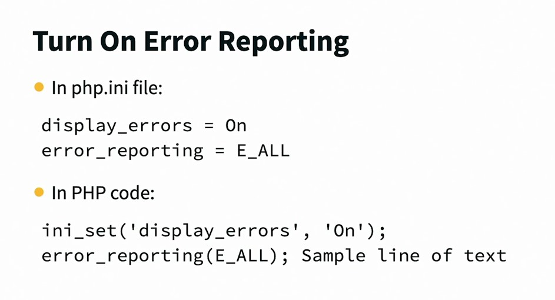
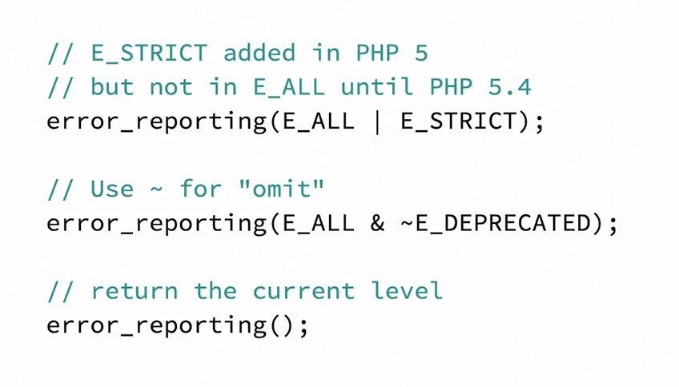
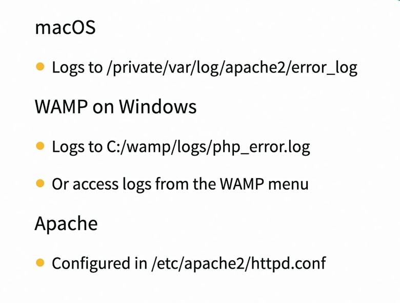
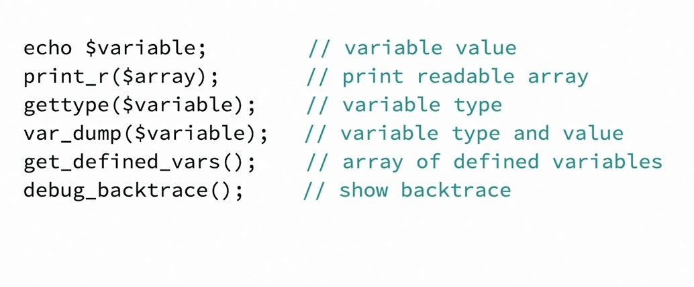
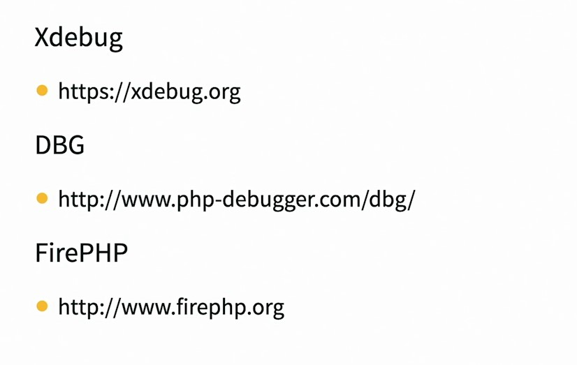

## 040-Common problems

Ошибки можно включить в php.ini или непосредственно в коде:  




 

Когда-то E_ALL не включал в себя строгие ошибки E_STRICT и последний нужно было указывать дополнительно.  
Исключение типов ошибок из отчётов достигается с помощью тильда ~ .  

Показать число, отображающее текущий уровень отображений ошибок, достигается вызовом функции `error_reporting()` без аргументов. Полный список чисел можно посмотреть здесь:  
https://www.php.net/manual/en/errorfunc.constants.php  


Логи и место хранения кофигурации логов:  

  

## 041-Debug and troubleshoot

  

debugging.php

```php
<body>
    <?php
      $number = 99;
      $string = "Bug?";
      $array = array(1 => "Homepage", 2 => "About Us", 3 => "Services");
      
      var_dump($number);
      var_dump($string);
      var_dump($array);
    
    ?>
    <br />
    <pre>
    <?php
      // print_r(get_defined_vars());
    ?>
    </pre>
    <br />
    <?php

      function say_hello_to($word) {
        echo "Hello {$word}!<br />";
        var_dump(debug_backtrace());
      }

      say_hello_to('Everyone');
    ?>
  </body>
```

Некоторые отладчики:

  


---

