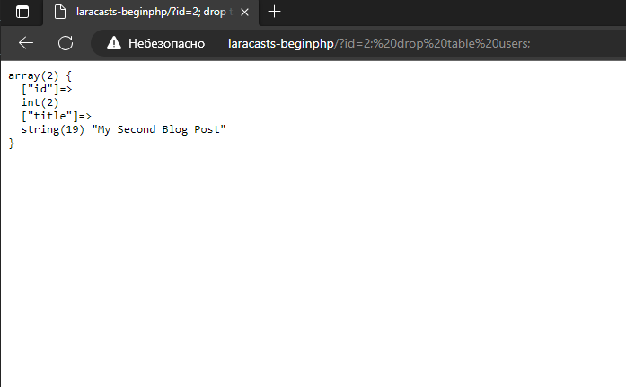

# 20.2 SQL-injection. Using :id

Система подстановочных знаков избавляет от SQL-инъекции. Это достигается следующим кодом.

1. index.php
```
    $query = "select * from posts where id = :id";

    $posts = $db->query($query, [':id' => $id])->fetch();
```
2. Database.php
```
    class Database {

    ...

    /**
     * @param array $params - ключ указывается в SQL-запросе, значение берётся из GET-параметра Url
     *
     **/ 
    public function query($query, $params=[])
    {
        $statement = $this->connection->prepare($query);
        
        $statement->execute($params);
        
        return $statement;
    }
}

```

В итоге SQL-инъекция не работает.

http://laracasts-beginphp/?id=2;%20drop%20table%20users;



