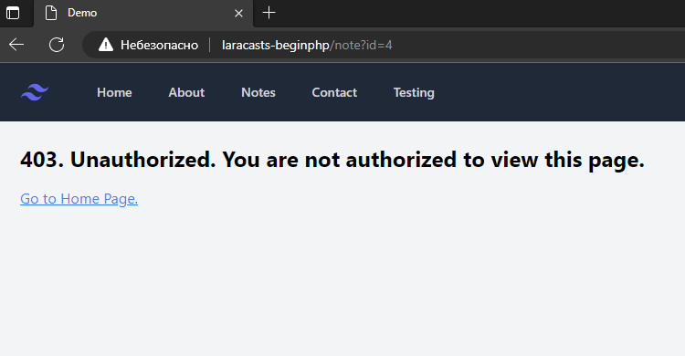
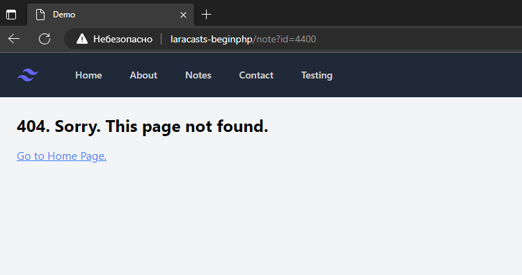

## 23 - Introduction to Authorization

### 23.0 Forbidding access to a note

Простейшее решение по запрету доступа к заметке. 
Все неодобренные к доступу заметки, в том числе существующие в БД, редиректят на 404.

http://laracasts-beginphp/note?id=4


http://laracasts-beginphp/note?id=440000


Достигается внедрением кода касательно user_id в controllers/note.php:
```
$note = $db->query('select * from notes where user_id = :user and id = :id', 
[   'user' => 1,
    'id'   => $_GET['id']
])->fetch();

// если получено false
if(!$note){
    abort();
}
```
В данном случае user жёстко закодирован.

## 23.1 403 and 404.

Различные ответы при недоступности страницы.

http://laracasts-beginphp/note?id=4



http://laracasts-beginphp/note?id=4400



Достигается:

изменением кода в controllers/note.php:
```
$note = $db->query('select * from notes where id = :id', [
    'id'   => $_GET['id']
])->fetch();

// если заметка не найдена по SQL-запросу - 404
if(!$note){
    abort();
}

// если user_id из строки табицы по SQL-запросу не равен 1 - 403
if($note['user_id'] != 1){
    abort(403);
}

```


