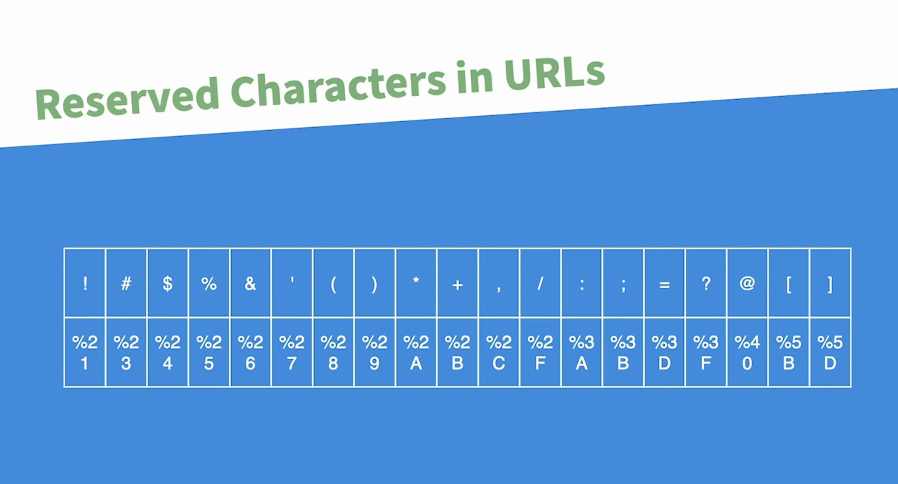
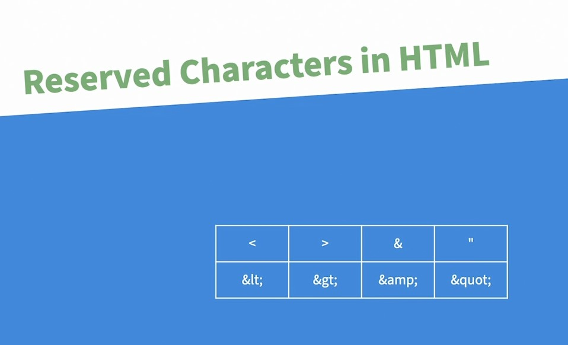

## Github

Далее следует использовать репозиторий  
https://github.com/sytnic/globe-bank/commits/master/  

В нём ориентироваться по коммитам и комментариям к ним. 

 ---

## 011-Encode URL parameters

Зарезервированные символы в URL

 

Для кодирования символов в адресной строке используются функции  

 - urlencode
 - rawurlencode

Разница следующая:  

 urlencode превращает пробелы в +  
 rawurlencode превращает пробелы в %20  

Рекомендации по использованию:  

- rawurlencode использовать до знака ? в url пути (%20)
- urlencode использовать после знака ? в url пути (для параметров, query string, строки запроса) (+) 

`urlencode` используется чаще.

Для обратной расшифровки есть функции:  
- urldecode($string)
- rawurldecode($string)

Но они редко применяются, потому что при попадании значений в GET из url-строки PHP автоматически декодирует зашифрованные символы для переменной $_GET.  

## 012-Encode for HTML

 

 Для них применяется `htmlspecialchars()`.

 ## 

---

