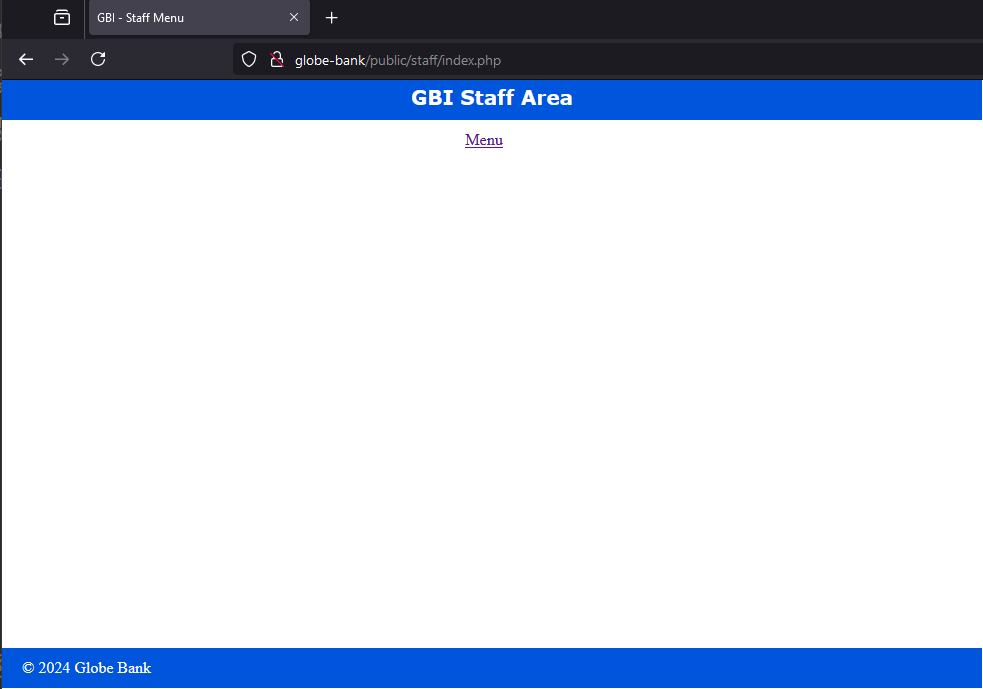
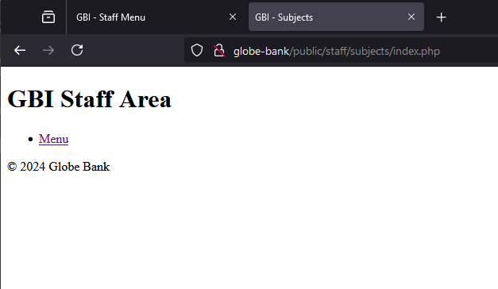

## Ex files

Чтобы добавить sql файл в базу данных через командную строку:  

    mysql -u root -p globe_bank < MyFile.sql

## 006 - Include

В строках, типа  

    <?php require_once('../../private/initialize.php'); ?>

надо использовать статические строки, а не динамические данные, для избежания проблем с безопасностью.  

## 07.1-Make page assets reusable

public/staff/index.php

```php
<?php require_once('../../private/initialize.php'); ?>

<?php $page_title = 'Staff Menu'; ?>
<?php include('../../private/shared/staff_header.php');  ?>

    <div id="content">
    </div>

<?php include('../../private/shared/staff_footer.php');  ?>
```



---

public/staff/subjects/index.php

```php
<?php require_once('../../../private/initialize.php'); ?>

<?php $page_title = 'Subjects'; ?>
<?php include('../../../private/shared/staff_header.php');  ?>

    <div id="content">
    </div>

<?php include('../../../private/shared/staff_footer.php');  ?>
```



## 07.2-Make page assets reusable

Добавлены Константы для использования постоянных путей к папкам.

# 2. Build Web Pages with PHP


