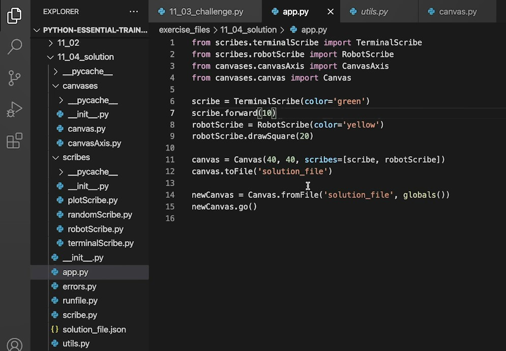

## 062-Command line arguments

Пример файла, запустив который, можно создать и записать новый файл .txt с текстом, указанным в команде в терминале.

Файл `11_1_writefile.py`

```py
from argparse import ArgumentParser 

parser = ArgumentParser()

parser.add_argument('--output', '-o', required=True, help='The destination file for the output of this program')
parser.add_argument('--text', '-t', required=True, help='The text to write to the file')


args = parser.parse_args()

with open(args.output, 'w') as f:
    f.write(args.text+'\n')

print(f'Wrote "{args.text}" to file "{args.output}"')
```

Команда в терминале выглядит так

    python 11_1_writefile.py -o somefile.txt -t "some text to write to the file"

## 063-Creating modules and packages

Как такового понятия библиотеки в Python нет.  
Есть модули и пакеты.  

Модуль - это файл python. 

Допустим, `primes.py` - файл с функциями. Импортирования модуля и использование его функций будет таким.

```py
import primes

print(primes.isPrime(5))
```

Пример импортирования только одной функции из модуля

```py
from primes import listPrimes

# функция модуля теперь вызывается напрямую
print(listPrimes(100))
```

Пакет - это коллекция модулей, коллекция связанных файлов Python, обычно объединённых в одну папку. В этой папке раполагают важный пустой файл `__init__.py`. Он указывает, что в папке не просто набор файлов, а файлы пакета.     

Пример импорта пакета из папки `numbers` файла (модуля) `factors` функции `getFactors`

```py
from numbers.factors import getFactors 

print(getFactors(100))
```

Модули (файлы) пакета внутри себя могут ссылаться друг на друга.  

Есть переменная `__name__` . Она указывает на программное название отдельного модуля, пакета или модуля в пакете.  

Пример использования `__name__` в отдельном модуле.  

```py
print(f'primes.py module name is {__name__}')
```

## 065-Solution Handling arguments

Разбивка монолитного кода из одного файла на несколько файлов и импорт кода.  
Нужно также иметь в виду, что глбальные переменные видны только внутри одного файла. Здесь предпринято решение с раздачей глобальных переменных через аргумент `globals()` функции `fromFile`.



## 066-Wrap up

Для обработки данных:  

https://pandas.pydata.org/

https://scikit-learn.org/stable/

Для REST API:

https://flask.palletsprojects.com/en/stable/

Парсинг веб-страниц:

https://www.selenium.dev/

---
