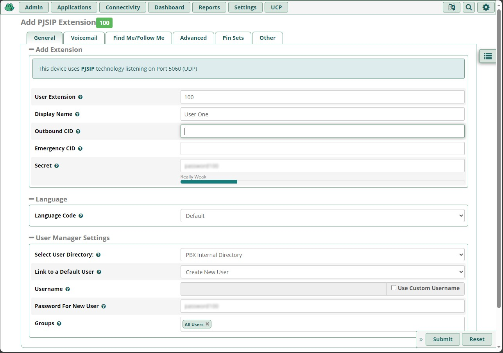
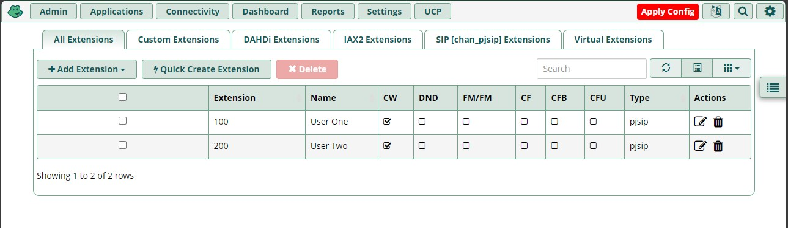

## 13-SDP

    v=0     - версия протокола SIP
    o=- 38412 77175 IN IP4 46.61.20.12    
            - идентификатор сеанса, имя время и откуда идёт сеанс
    s=SBC call
            - имя сеанса, обязательное
    i= SBC on the session description protocol   
            - дополнительная информация о сеансе
    u=      - url-ссылка на справку о сеансе, необязательное
    e=      - контактная информация, email
    c=IN IP4 46.61.20.12      
            - информация о соединении, куда идёт сеанс
    t=0 0   - time, время сеанса, начало конец
    a=      - методы сип-сеанса (например, получение recvonly, получение-отправка)
    m=audio 21348 RTP/AVP 8 0 18 98 96 97 101
            - media, методы сеанса (например, аудио порт протокол приоритеты порта, видео)
    a=rtpmap:98 G.729a/8000
            - какие протоколы сеанса доступны
    a=rtpmap:96 G.729ab/8000
            - какие протоколы сеанса доступны
    a=rtpmap:97 G.729b/8000
            - какие протоколы сеанса доступны
    a=rtpmap:101 telephone-event/8000
    a=fmtp:101 0-15
    a=fmtp:18 annexb=no
    a=ptime:10
    a=X-vrzcap:vbd Ver=1 Mode=FaxPr ModemRtpRed=0
    a=X-vrzcap:identification bin=DSR2898 Prot=mgcp App=MG

## 16-SIP packets

Эта строка в Wireshark в расшифровке SDP указывает на возможность использования DTMF сигналов телефона.

    Media Attribute (a): rtpmap:101 telephone-event/8000

Цифры в rtpmap:101 указывают больший или меньший приоритет в выборе способов коммуникации. Примеры цифр: 8 0 18 98 96 97 101 .

## 017-Installing FreePBX in VirtualBox

Настройка пустой вирт.машины:

Выставить:
- Linux - Other Linux
- Bridged Network Adapter (Сетевой мост)

ISO:  
https://www.freepbx.org/downloads/

Далее вход в линукс по root. В браузере основной системы (хоста) вбить адрес, указанный на приветсвенной картинке (eth0:):  
например, 192.168.32.176  

В браузере создать пользователя (администратора), например, cmorin - cmorin с любой почтой (можно вымышленную) для уведомлений.

Выключение вирт.машины:  

    shutdown

## 018-Настройка расширений

Выбрать добавление расширения:
  
> Add New SIP [chan_pjsip] Extension

Настроить:

Нажать Apply Config:

## 020-Tracing a Real Phone Call and Reviewing Wireshark

Запуск и захват пакетов в файл дампа Wireshark из корня ОС

    cd /
    tcdump -w callcapture.pcap

С помощью программы WinSCP можно подключиться и скачать в Windows получившийся файл дампа.

В дампе нужно выполнить фильтрацию по sip.  
Также можно зайти в пункт меню Телефония - Потоки SIP.  

## 027-Troubleshooting Bad Call Quality
  
Чтобы улучшить качество звонков  
на стороне сервера:  

- использовать лучшие кодеки
- сжимать заголовки
- передача пакетов звука долдна быть приоритетней, чем передача или скачивание файлов по сети
- можно пометить пакет и проследить его путь от точки А к точке Б

## 028-The SIP RFCs

Документы RFC

SIP RFC 3261

https://www.ietf.org/rfc/
https://www.ietf.org/rfc/rfc3261.html

https://wiki.dieg.info/sip
https://wiki.dieg.info/rfc

DTMF RFC 2833

https://www.ietf.org/rfc/rfc2833.html

Early Vedia RFC 3960

https://www.ietf.org/rfc/rfc23960.html

---

