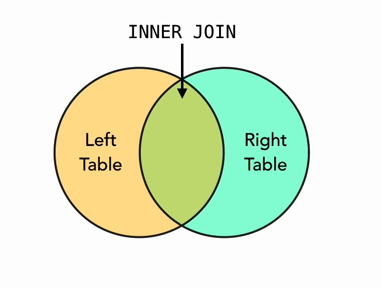
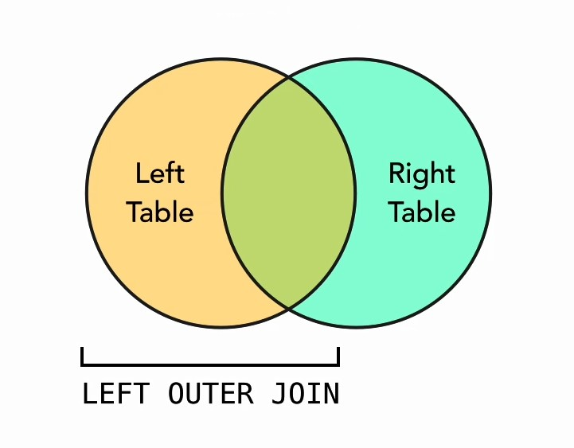
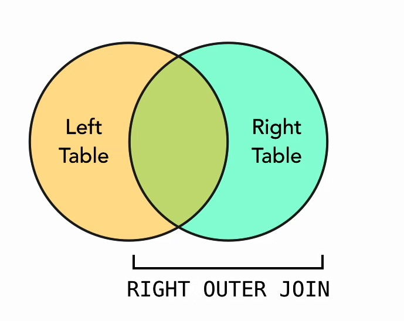
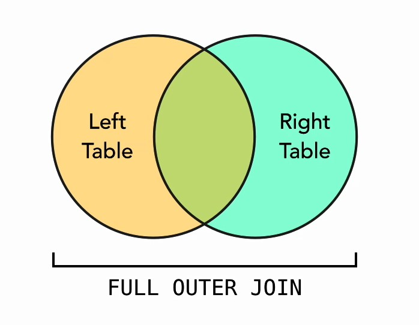

## 03_01. Соединение таблиц

Самое простое соединение - Внутреннее. Оно применяется по умолчанию вместе со словом JOIN. Иначе оно может записываться как INNER JOIN. 

Диаграммы Венна показывают соединения наглядно:  



LEFT OUTER JOIN. Внешнее соединение. Используются все записи из левой таблицы, и все совпавшие записи между таблицами слева и справа. В этом случае обычно опускают слово OUTER, потому что подразумевается, что левое соединение всегда внешнее.



"Слева" и "Справа" на самом деле условности. Под ними просто подразумевают таблицы, расположенные в запросе относительно слова JOIN. 

Аналогично левому есть правое внешнее соединение. RIGHT OUTER JOIN. Оно считается специальным случаем и многие СУБД (в т.ч. SQlite) его не поддерживают. Правое соединение можно реализовать как левое, просто изменив порядок расположения таблиц в запросе.  



FULL OUTER JOIN. Полное внешнее соединение включает все строки из обоих таблиц, в т.ч. для которых выполняется условие запроса. Многие СУБД (в т.ч. SQlite) его не поддерживают.  



## 03_02. Доступ к связанным таблицам с помощью JOIN

```sql
-- join example tables, left and right
CREATE TABLE left ( id INTEGER, description TEXT );
CREATE TABLE right ( id INTEGER, description TEXT );

--...

SELECT l.description AS left, r.description AS right
  FROM left AS l
  JOIN right AS r ON l.id = r.id
  ;
```

## 03_03. Работа с несколькими связанными таблицами 

Если есть связующая таблица между двумя другими (отношение "многие ко многим"), то часто применяются соединения Внутреннее (INNER JOIN) и Внешнее Левое (LEFT OUTER JOIN) .

INNER JOIN. Здесь будут найдены строки, точно подпадающие под условие запроса.

```sql
SELECT * FROM customer;
SELECT * FROM item;
SELECT * FROM sale;

SELECT c.name AS Cust, i.name AS Item, s.price AS Price
  FROM customer AS c   -- считается левой таблицей в соединении
  JOIN sale AS s ON s.customer_id = c.id
  JOIN item AS i ON s.item_id = i.id
  ORDER BY Cust, Item
;
```

LEFT OUTER JOIN. Здесь будут найдены строки, подпадающие под условие запроса, а также все оставшиеся строки из левой таблицы customer .

```sql
-- left joins
SELECT c.name AS Cust, i.name AS Item, s.price AS Price
  FROM customer AS c
  LEFT JOIN sale AS s ON s.customer_id = c.id
  LEFT JOIN item AS i ON s.item_id = i.id
  ORDER BY Cust, Item
;
```

---
