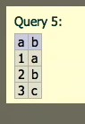
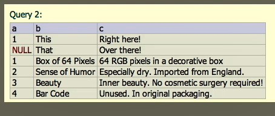
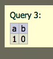
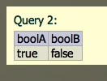
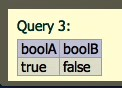

## 02_02. Обзор синтаксиса SQL

Комментарии:

    -- this is a comment

Начиная с SQL2003 возможны:  

    /*
        multiline
        comment
    */


FROM, WHERE называются предложениями.  
Population/1000000, Population >= 1000000 называются выражениями.  
COUNT(*) называются функциями.   

## 02_04. Создание таблицы - CREATE TABLE

    CREATE TABLE test (
      a INTEGER,
      b TEXT
    );

    INSERT INTO test VALUES ( 1, 'a' );
    INSERT INTO test VALUES ( 2, 'b' );
    INSERT INTO test VALUES ( 3, 'c' );
    
    SELECT * FROM test;



## 02_05. Удаление таблицы - DROP TАВLE

    CREATE TABLE test ( a TEXT, b TEXT );
    
    INSERT INTO test VALUES ( 'one', 'two' );
    SELECT * FROM test;
    
    DROP TABLE test;
    DROP TABLE IF EXISTS test;

## 02_06. Вставка строк в таблицу

    CREATE TABLE test ( a INTEGER, b TEXT, c TEXT );
    SELECT * FROM test;

    INSERT INTO test VALUES ( 1, 'This', 'Right here!' ); 
    INSERT INTO test ( b, c ) VALUES ( 'That', 'Over there!' );


Использование Подзапроса

    INSERT INTO test ( a, b, c ) SELECT id, name, description from item;



## 02_07. Удаление строк из таблицы

    SELECT * FROM test;
    DELETE FROM test WHERE a = 3;
    
    SELECT * FROM test WHERE a = 1;
    DELETE FROM test WHERE a = 1;

## 02_08. Что такое NULL

```sql
SELECT * FROM test WHERE a IS NULL;
SELECT * FROM test WHERE a IS NOT NULL;
```
Вставка четвертой строки

    INSERT INTO test ( a, b, c ) VALUES ( 0, NULL, '' );


    -- Создание таблицы, где NULL не допускается
    CREATE TABLE test (
      a INTEGER NOT NULL,
      b TEXT NOT NULL,
      c TEXT
    );
    ```

## 02_09. Контроль столбцов с помощью ограничений

```sql
CREATE TABLE test ( a TEXT, b TEXT, c TEXT NOT NULL );
CREATE TABLE test ( a TEXT, b TEXT, c TEXT DEFAULT 'panda' );
CREATE TABLE test ( a TEXT UNIQUE, b TEXT, c TEXT DEFAULT 'panda' );
CREATE TABLE test ( a TEXT UNIQUE NOT NULL, b TEXT, c TEXT DEFAULT 'panda' );
```

## 02_10. Изменение схемы с помощью ALTER TABLE

```sql
-- Добавление столбцов

ALTER TABLE test ADD d TEXT;
ALTER TABLE test ADD e TEXT DEFAULT 'panda';
```

## 02_11. Столбцы идентификаторов - PRIMARY KEY

```sql
CREATE TABLE test (
  id INTEGER PRIMARY KEY,
  a INTEGER,
  b TEXT
);
```

## 02_12. Фильтрация данных с помощью WHERE, LIKE и IN

```sql
SELECT * FROM Country;
SELECT Name, Continent, Population FROM Country WHERE Population < 100000 ORDER BY Population DESC;
SELECT Name, Continent, Population FROM Country WHERE Population < 100000 OR Population IS NULL ORDER BY Population DESC;
SELECT Name, Continent, Population FROM Country WHERE Population < 100000 AND Continent = 'Oceania' ORDER BY Population DESC;

-- LIKE
SELECT Name, Continent, Population FROM Country WHERE Name LIKE '%island%' ORDER BY Name;

-- один подстановочный знак _
SELECT Name, Continent, Population FROM Country WHERE Name LIKE '_a%' ORDER BY Name;

-- IN
SELECT Name, Continent, Population FROM Country WHERE Continent IN ( 'Europe', 'Asia' ) ORDER BY Name;
```

## 02_13. Исключение дубликатов - SELECT DISTINCT

```sql
SELECT Continent FROM Country;
SELECT DISTINCT Continent FROM Country;
```
Using the SELECT DISTINCT statement, you will get only unique results. 


```sql
SELECT DISTINCT a FROM test;
SELECT DISTINCT b FROM test;
SELECT DISTINCT a, b FROM test;
```

## 02_14. Сортировка с помощью ORDER BY

```sql
SELECT Name FROM Country;
SELECT Name FROM Country ORDER BY Name;
SELECT Name FROM Country ORDER BY Name DESC;
SELECT Name FROM Country ORDER BY Name ASC;
SELECT Name, Continent FROM Country ORDER BY Continent, Name;
SELECT Name, Continent, Region FROM Country ORDER BY Continent DESC, Region, Name;
```

## 02_15. Условные выражения и ключевое слово CASE

```sql
CREATE TABLE booltest (a INTEGER, b INTEGER);
INSERT INTO booltest VALUES (1, 0);
SELECT * FROM booltest;
```



```sql
SELECT
    CASE WHEN a THEN 'true' ELSE 'false' END as boolA,
    CASE WHEN b THEN 'true' ELSE 'false' END as boolB
    FROM booltest
;
```
Так была создана новая таблица со столбцами boolA и boolB, и, соответсвенно, значениями true и false. Проверялся столбец а, если он истинен, то записывается true, если ложен, то - 'false' (WHEN a THEN 'true' ELSE 'false'). Аналогично проверялся стоблец b из таблицы booltest.  
Это сравнение с истиной (булево).



```sql
SELECT
  CASE a WHEN 1 THEN 'true' ELSE 'false' END AS boolA,
  CASE b WHEN 1 THEN 'true' ELSE 'false' END AS boolB 
  FROM booltest
;
```

Другая вариация. Сравнение с 1: если a == 1 и b == 1.



---