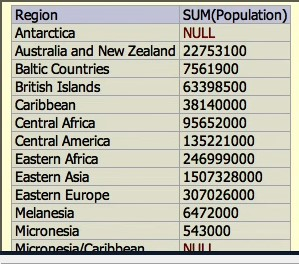

## 07_01. Агрегированные данные. Общие сведения

-- world.db

```sql
SELECT COUNT(*) FROM Country;
-- Result: 239

SELECT Region, COUNT(*)
  FROM Country
  GROUP BY Region
;
```


```sql
SELECT Region, COUNT(*) AS Count
  FROM Country
  GROUP BY Region
  ORDER BY Count DESC, Region
;
```


-- album.db

```sql
SELECT a.title AS Album, COUNT(t.track_number) as Tracks
  FROM track AS t
  JOIN album AS a
    ON a.id = t.album_id
  GROUP BY a.id
  ORDER BY Tracks DESC, Album
;
```


```sql
SELECT a.title AS Album, COUNT(t.track_number) as Tracks
  FROM track AS t
  JOIN album AS a
    ON a.id = t.album_id
  GROUP BY a.id
  HAVING Tracks >= 10
  ORDER BY Tracks DESC, Album
;
```
HAVING используется только с агрегированными данными. Его можно понимать как WHERE для агрегированных данных.  


 

```sql
SELECT a.title AS Album, COUNT(t.track_number) as Tracks
  FROM track AS t
  JOIN album AS a
    ON a.id = t.album_id
  WHERE a.artist = "The Beatles"
  GROUP BY a.id
  HAVING Tracks >= 10
  ORDER BY Tracks DESC, Album
;
```
WHERE добавляет дополнительное условие. Оно указывается до HAVING. 


## 07_02. Использование агрегирующих функций

```sql
-- world.db
SELECT COUNT(*) FROM Country;
-- 239

SELECT COUNT(Population) FROM Country;
-- 232

SELECT AVG(Population) FROM Country;
-- 26201506.25

SELECT Region, AVG(Population) FROM Country GROUP BY Region;
-- 
```


```sql
SELECT Region, MIN(Population), MAX(Population) FROM Country GROUP BY Region;
```


```sql
SELECT Region, SUM(Population) FROM Country GROUP BY Region;
```


## 07_03. Агрегация разных значений

```sql
-- world.db

SELECT COUNT(HeadOfState) FROM Country;
-- 238

SELECT HeadOfState FROM Country ORDER BY HeadOfState;
-- содержит повторяющиеся значения

SELECT COUNT(DISTINCT HeadOfState) FROM Country;
-- 179; не содержит повторяющиеся значения

```

---