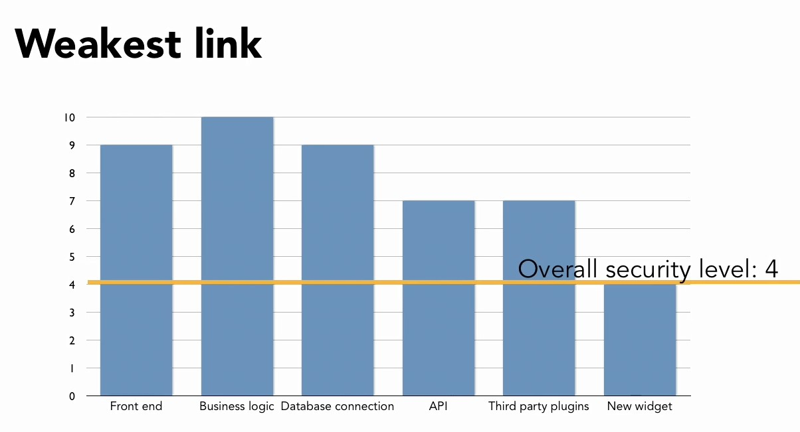

# 1. Обзор безопасности

## 1_03. Кто такой хакер

Белые хакеры.  
Черные хакеры. Они делятся на многие группы.  

## 1_04. Тотальная безопасность недостижима

Уязвимость нулевого дня - разработчик или компания знали об этой проблеме ноль дней и ноль дней работали над ее решением.  

Общий уровень безопасности равен уровню безопасности самого уязвимого звена.  



---

# 2. Главные принципы безопасности

## 2_01. Принцип наименьших привилегий

## 2_02. Чем проще - тем безопаснее

--  
Simple is More Secure

- Complexity invites bugs.
- Use clearly named functions and variables
Write code comments
- Break up long sections of code into small functions
- Don't repeat yourself

Простое более безопасно

- Сложность приводит к появлению ошибок.
- Используйте функции и переменные с четкими названиями
- Пишите комментарии к коду
- Разбивайте длинные участки кода на небольшие функции
- Не повторяйтесь

--  
Simple is More Secure

- Legacy code is a security concern
- Built-in functions are often better than your own versions
- Disable or remove unused features when possible

Простой - значит более безопасный

- Устаревший код - это проблема безопасности
- Встроенные функции часто лучше, чем ваши собственные версии
- По возможности отключайте или удаляйте неиспользуемые функции

## 2_03. Никогда не доверяйте юзерам
## 2_04. Ожидайте неожиданное
## 2_05. Глубокая защита

Это - многоуровневая защита.  

Области, куда это распространяется:  
- люди
- технологии, софт
- процедуры, отслеживание процессов, пошаговые инструкции

## 2_06. Безопасность через неясность

Чем меньше информации вы даете, тем лучше.  

## 2_07. Черные и белые списки

Черный список - действия, которые запрещены администратором системы.  
Белый список - действия, которые разрешены администратором системы.  
Более безопасный подход - создавать белые списки: только то, что разрешено.  

## 2_08. Точки взаимодействия и каналы передачи данных

В Блокноте или спец софте следует накидать путь, который проходят данные: входные и выходные доступные точки.

---
# 3. Фильтрация входных и контроль выходных данных

## 3_01. Регламентация HTTP запросов

Допускать только те запросы, которые ожидаются: Get, POST.

## 3_02. Валидация входных данных

Фильтруем входные данные в соотвествии с ожидаемыми типами и характеристиками.

## 3_03. Дезинфекция данных

Следует  
- явно приводить типы переменных к нужному типу вместо позволения языку жонглировать типами в фоне  
- использовать html-сущности, например `&lt;` вместо знака `<`  
- экранировать данные, например, обратным слэшем перед значением: `'\`  
- использовать встроенные функции языка  

## 3_04. Называем переменные правильно и ясно

До дезифекции переменные можно называть:  

    dirty, raw, tainted, unsafe.

После дезифекции переменные можно называть: 

    clean, filtered, sanitized, safe

Пример на PHP:  

```php    
    $raw_email = $_POST['email'];
    $safe_email = sanitize($raw_email);
    
    // или более сокращённо
    $safe_email = sanitize($_POST['email']);
```

## 3_05. Сохраняем приватность кода

Следует создавать папки

    /private
    /public

и чаще использовать функции, спрятанные в `private`. В `public`, таким образом, следует оставлять только "скучный код", и тогда не страшно, если он вдруг станет доступен, например из-за ошибок работы веб-страницы.

Также следует настроить конфигурацию веб-сервера:

- указать корневой каталог для публичной зоны
- поставить доступность и недоступность других папок, например, с помощью .htaccess

## 3_06. Сохраняем приватность учетных данных

Логины и пароли, которые используются рабочим кодом для доступа к различным ресурсам (БД, платежные системы), следует размещать в отдельном файле, и потом ссылаться на него из кода.  
Файл следует оградить от системы контроля версий.

Не использовать одинаковые пароли.  

Пароли надо хранить зашифрованными (hashed).  
Следует использовать принципы открытого и закрытого ключа для доступа к паролям.  

## 3_07. Выводите расплывчатые сообщения об ошибках

Полезно настроить вывод собственных страниц с ошибками. При этом не обязательно указывать, какая именно ошибка произошла - с сервером или приложением.  
Ошибки полезно отправлять по почте или в лог-файлы вместо того, чтобы выводить их на экран.  

## 3_08. Умное логирование

Логируйте
- ошибки
- важные действия
- всё подозрительное

Необходимые данные:
- время
- источник (user, IP)
- действия
- цель
- Куки/Сессии
- URL и все его параметры
- Обратная трассировка

Не логируйте
- важные данные (пароли, ключи, токены)

Сохраняйте старый контент
- контент под версионированием
- мягкое удаление

---
# 4. Наиболее распространенные атаки

## 4_01. Межсайтовый скриптинг (XSS)

Код внедряется через чужой Javascript.  
Возможность: получить данные куков, и, в итоге, сессии.

Данные, выводимые на экран, получаемые из форм, гет-запросов (Url), куков, сессии или БД, нужно санитаризировать.

## 4_02. Межсайтовая подделка запросов (CSRF)

Используйте POST для передачи и установления важных данных. Его нельзя передать в Get, а следовательно, тогда нельзя подловить пользователя неразлогинившегося на важном сайте с помощью вредоносного кода, встроенного на иной сайт.

Также для предоивращения CSRF используют токены формы.

## 