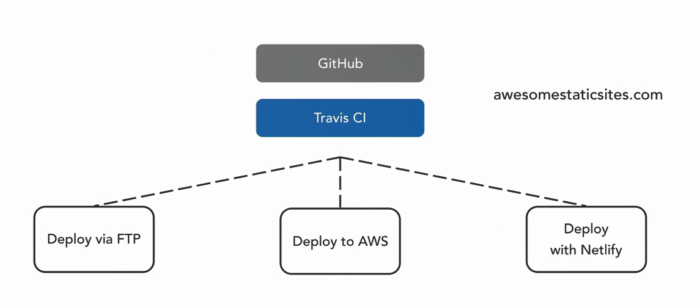

## 01.Publishing.options.for.static.sites

Способы автоматического развертывания проекта в интернет

Для Netflify натсройка Travis не требуется  

## 02.Set.up.GitHub

## 03.Set.up.Travis.CI

https://www.travis-ci.com/

Однако он платный. Бесплатный .org закрылся.

https://qastack.ru/devops/1201/whats-the-difference-between-travis-ci-org-and-travis-ci-com

Первые 100 сборок в Travis CI бесплатны. Также доступна бесплатная пробная версия сервиса:

https://tr-page.yandex.ru/translate?lang=en-ru&url=https%3A%2F%2Fwww.g2.com%2Fproducts%2Ftravis-ci%2Fpricing

38 Аналогов:  

https://habr.com/ru/companies/slurm/articles/706646/

---
