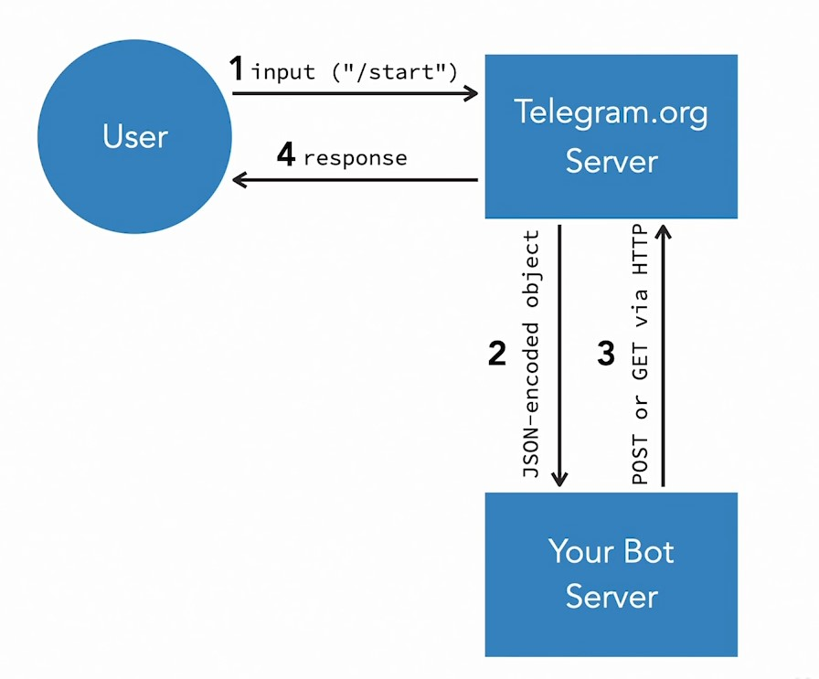

# Intro

## 003-Your bot server's requirements

https://core.telegram.org/

https://core.telegram.org/bots

https://core.telegram.org/bots/api

Боты связываются с телеграм-серверами двумя способами: 

Long Polling (длительный опрос):  

требования:  
- сервер, который может отправлять и получать JSON
- достаточным будет прерывистое общение с сервером

Webhooks:

требования:  
- необходимо постоянное подключение к серверу
- свободные порты 80,88,443, или 8443
- домен или поддомен
- SSL-сертификат

https://core.telegram.org/bots/webhooks

https://core.telegram.org/bots/self-signed

https://core.telegram.org/bots/faq

# 1. How Telegram Bots Work

## 006-What is a Telegram bot

Запрос Ответ

## 008-Explore the world of Telegram bots

Примеры  

    @RemindMeBot_bot
    @TheTimeBot (не работает)
    @IMDb
    @botlist

## 009-What bots can't do

Боты, как сайты, не хранят информацию и не имеют хранения состояния (сессии). Чтобы хранить информацию, к ним подключают базы данных.  

Ограничения  

https://telegra.ph/so-your-bot-is-rate-limited-01-26

## 010-Using bot development libraries

Пример бота "без кодирования"

https://manybot.io/

Библиотеки для ботов

https://core.telegram.org/bots/samples

Пример библиотеки

https://github.com/unreal4u/telegram-api

https://github.com/unreal4u/telegram-bots

https://github.com/unreal4u/telegram-bots/blob/master/src/Bots/TheTimeBot.php

   