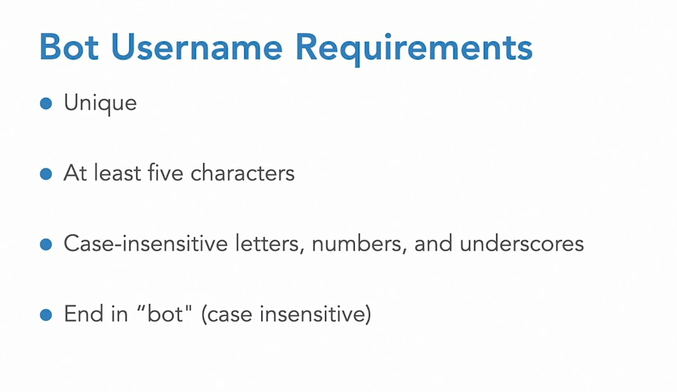
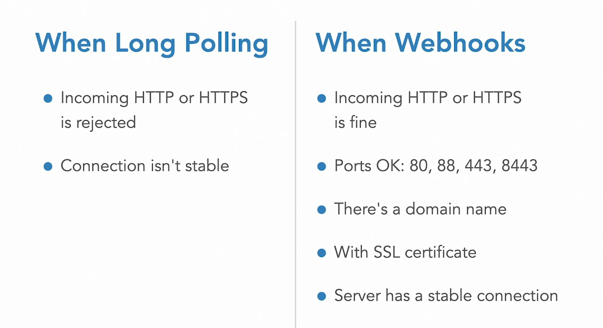

# 2. Communicate with Telegram

## 011-Register your bot with botfather

Ищем

@BotFather

Вводим

    /newbot



Справка

    /help

Или найти справку по BotFather по адресу

https://core.telegram.org/bots

## 012-Send requests to Telegram's servers

https://core.telegram.org/bots/api

Чтобы узнать свой токен, команды в BotFather:

    /token  
    -- не генерирует новый токен, показывает уже существующий

    /mybots

https://core.telegram.org/bots/api#making-requests 

**Получить инфо в браузере по боту**

    https://api.telegram.org/botTOKEN/getMe

botTOKEN - это слово "bot" + token, как например,  
> bot1234567890:AAAffftreryfgngjmhuqweiopmmvczxcvio

где 1234567890:AAAffftreryfgngjmhuqweiopmmvczxcvio - токен .

**Отправить сообщение в чат**

    https://api.telegram.org/botTOKEN/sendMessage?chat_id=0123456789&text=Hello

    https://api.telegram.org/botTOKEN/sendMessage?chat_id=0123456789&text=Hello and Welcome. This is KinetecoHelpBot.

Сообщение от бота придёт, только если бот был запущен пользователем посредством `/start`.  
Свой `chat_id` можно узнать из Json Dump Bot .

## 013-Always on connections with webhooks

Есть два типа коннектов ботов с серверами Telegram.  
Требования к коннектам:  



### Webhooks

1) Создать поддомен (домен)

2) Связать бота с сервером с помощью Webhooks 

https://core.telegram.org/bots/api#setwebhook

Для связки набрать в браузере:  

    https://api.telegram.org/botTOKEN/setWebhook?url=https://mysubdomen.mydomen.com/index.php

Будет получено Json-сообщение "ok" .

Чтобы получить общую информацию о своем Webhook:

    https://api.telegram.org/botTOKEN/getWebhookInfo

Справка и решение проблем:  

https://core.telegram.org/bots/webhooks

## 014-As needed connections with long polling

Можно использовать либо webhooks, либо long-polling.  

Удалить webhooks  

Далее предварительно идущая строка 
https://api.telegram.org/botTOKEN  
не повторяется

    /deleteWebhooks

Перепроверить (url будет пустой)

    /getWebhookInfo

Если в Телеграме отправить сообщение, и потом в строке браузера вбить

    /getUpdates

, то будут получены эти сообщения в json-формате.

Так работает long-polling.

Эти сообщения имеют каждый свой update_id и он выдаётся новым в порядке очереди, т.е. на единицу больше получает каждое новое сообщение.

Получить конкретное сообщение

    /getUpdates?offset=012345678(update_id)

Демонстрация ответа сервера в телеграм бот на сообщение пользователя. На сервере лежат два файла index.php и constants.php

index.php нужно запустить из терминала на сервере. Он будет ожидать сообщение, и отправит ответное в чат бота.  

> index.php

```php
// PHP example of long polling that returns only the latest update.

// constants.php contains $bot_token: Stored in a separate file for security
include_once 'constants.php';

// The URL where the bot sends responses
$url = "https://api.telegram.org/bot" . BOT_TOKEN . "/";
// Start the counter mechanism at zero
$last_update = 0;

// Start an endless loop
while (true) {
  // Get your bot's most recent updates from Telegram's servers
  $update = file_get_contents($url . 'getUpdates?offset=' . ($last_update + 1));
  // Convert the JSON into an object for ease of handling
  $update = json_decode($update);

  // Go through each pending update
  foreach ($update->result as $key => $update_item) {
    // Only act on the most-recent update
    if ($update_item->update_id > $last_update) {
      // Prepare the message chat_id and text
      $chat_id = $update_item->message->chat->id;
      $message = urlencode(
        'Update ID=' . $update_item->update_id . ', text = ' . $update_item->message->text
      );
      // Send the message via GET by constructing a URL
    	file_get_contents($url . "sendMessage?text=$message&chat_id=$chat_id");
      // Update the $last_update counter
      $last_update = $update_item->update_id;
    }
  }
  sleep(1);
}
```

> constants.php

```php
define('BOT_TOKEN', 'PASTE-YOUR-BOT-TOKEN-HERE');
```

## 015-Create your first bot program

Опять установить webhook (он понадобится до конца курса)

    /setWebhook?url=https://mysubdomen.mydomen.com/bot/index.php

На поддомене положить php файлы из упражнений.  
Но лучше создать гитхаб репозиторий с коммитами (так как далее будет много изменений) и скачивать репозиторий через SSH на поддомен. Далее можно будет откатываться к любому коммиту прямо на поддомене.

Я указал поддомен явно, без указания на index.php. В ответ пришло подтверждение

    {"ok":true,"result":true,"description":"Webhook was set"}

Проверить статус бота на webhook можно так

    https://api.telegram.org/botYOURTOKEN/getWebhookInfo

Теперь можно запустить от себя любое сообщение в Бота, и он вернёт обратно объект, наподобие Json Dump Bot.   

## 016-Challenge

## 017-Solution Create a Who am I bot

Бот обрастает функциями.

---
