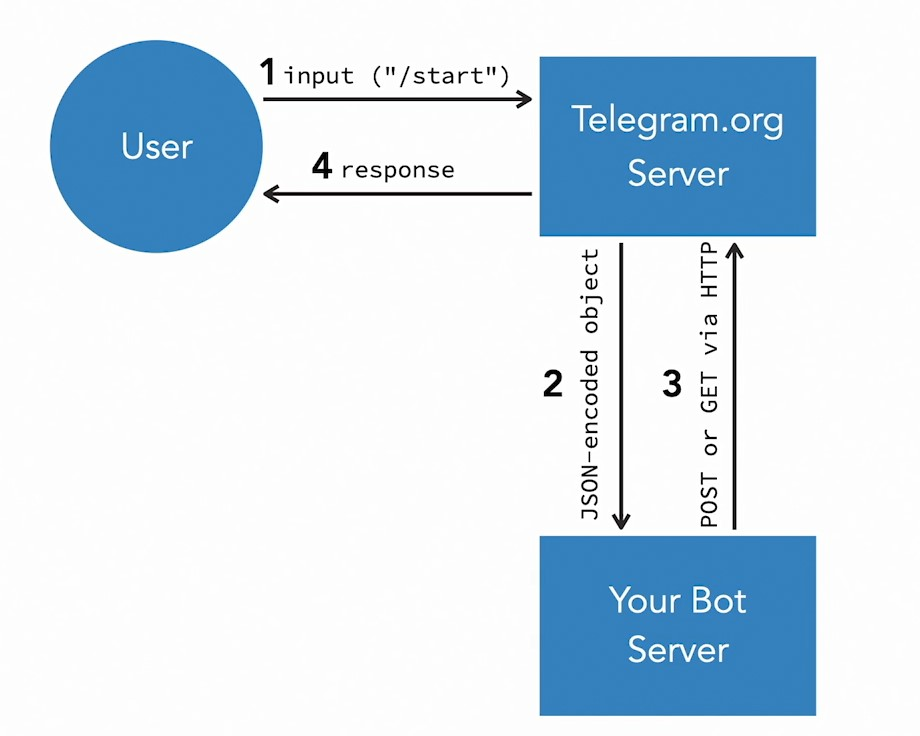

# Learn API Programming by Building a Telegram Bot 2023

## 015-Create your first bot program

> Сделать git init в проекте и создать онлайн-репозиторий

> Создать поддомен (или использовать технический поддомен)

> Создать SSL-сертификат к поддомену

> Скачать по SSH файлы бота c онлайн-репозитория в корень поддомена (либо как файлы, либо как папку с файлами)

    git clone https://github.com/user/myrepository

> Установить webhook для бота в адресной строке браузера.

Вероятно, если в корень поддомена (домена) положена папка, внутри которой файл index.php, то целью указывается этот файл index.php.
Предпочёл этот вариант. Потому что к работающему поддомену можно получить доступ по https в браузере. Тогда в брузер будет загружен index.php бота. А это кажется нежелательным.

    https://api.telegram.org/botYOURTOKEN/setWebhook?url=https://mysub.domen.ru/bot/index.php

Или, если в корень поддомена (домена) положены файлы наряду с файлом index.php, то целью указывается этот файл index.php или сам поддомен (домен).

    https://api.telegram.org/botYOURTOKEN/setWebhook?url=https://mysub.domen.ru/index.php

    https://api.telegram.org/botYOURTOKEN/setWebhook?url=https://mysub.domen.ru/

Также - не обязательно использовать поддомен, можно домен.

Ответ должен быть:

    {"ok":true,
     "result":true,
     "description":"Webhook was set"
    }

Если webhook установлен {"ok":true, ...}, то можно отправлять сообщения боту из Телеграм.

Проверить статус бота на webhook можно так

    https://api.telegram.org/botYOURTOKEN/getWebhookInfo

Должен быть ответ

    {"ok":true,
        "result": {
            "url":"https://..../bot/index.php",
            "has_custom_certificate":false,
            "pending_update_count":0,
            "max_connections":40,
            "ip_address":"...."
        }
    }

## 018-Understand Telegram native data types

Отправляемый с сервера телеграм на сервер бота JSON объект (2) называют updates .

Update всегда содержит 2 поля:  
- udpate_id  

и одно из полей, различающихся по типу, например:
- message

https://core.telegram.org/bots/api#getting-updates  

Это второе поле обычно содержит другие поля (как переменные) и объекты (как массивы).  

## 
