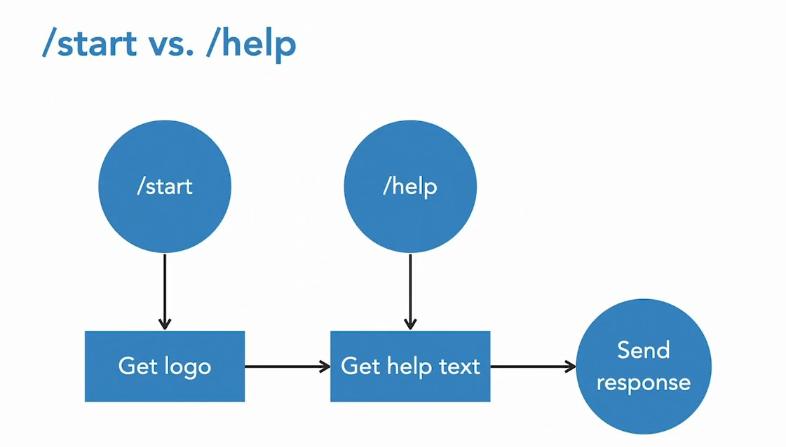

## 027-Work with multimedia

### Выяснить id фото, хранящееся на серверах телеграма

Когда мы прикрепляем фото с компьютера или отправляем с url в телеграм, телеграм
- преобразует фото в .jpg
- сохраняет и хранит его у себя на серверах под определенным id.

> Как сохранить фото на сервере телеграм:

- Отправить фото со своего компа в свой чат.  
- Переслать это фото из чата в Json Dump Bot.

Будет получен ответ с  file_id

    "photo": [
      {
        "file_id": "AgACAgIA..."
        ...
      }
    ]


## 028-Improve your code with Telegram standards

### Перезапустить чат с ботом с нуля

В правом верхнем углу чата выбрать Delete Chat. Далее галочка Stop Bot (Остановить и блокировать) и Delete.

### Чтобы добавить описание к своему боту еще до входа в него

В BotFather после /help выбрать 

    /setdescription

и своего бота в списке.

Далее набрать, например,

    This is fictive company for learning. This bot provides automated help with Kineteco's billing and technical issues.

### Задать информацию о боте

В BotFather после /help выбрать

    /setabouttext

и своего бота в списке.

Далее набрать, например,

    Kineteco's bot for automated help and customer service.

### Задать аватар бота

В BotFather после /help выбрать

    /setuserpic

и своего бота в списке.

Далее выбрать фото с комьютера, прикрепить с помощью "скрепки" и отправить в BotFather.

Также нужно не забыть в коде настроить команды /start и /help как выполняющие одно и то же.

### Метод /setcommands от BotFather

Это метод настройки команд моего бота. 

    /setcommands

Далее в BotFather отправляют текстовый список и описание своих команд без слэша, каждая в новой строке.  
```
gethelp - Get billing and tech FAQs, or connect to customer Service
help - Get this help text
whoami - Get your own Telegram identity (could help us to help you)
```
В итоге после того, как пользователь введёт / , сразу выпадет список предлагаемых команд.

## 030-Solution Welcome users with a logo and styled text

На данный момент /help и /start работают идентично, вызывая один и тот же файл в /functions.  
Требуется к /start добавить логотип и первое предложение справки, выделенное жирным,  
а к /help - только первое предложение справки, выделенное жирным.

Вследствие их похожести и чтоб не повторяться, следует использовать их так:



---