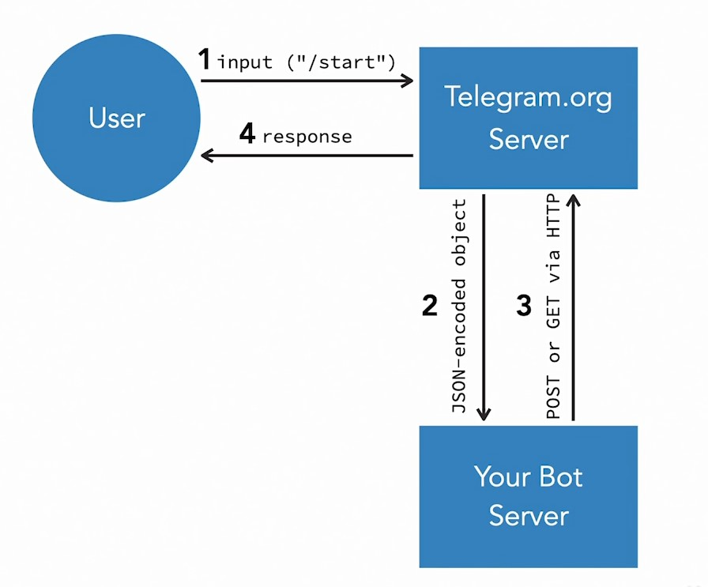

## 031-Security and performance of Telegram bots

Способы защиты бота

- Переместить бота в выдуманную папку и подключить её как обычно с помощью `/setWebhook?url=...` . Проверить результат можно будет как обычно через `/getWebhookinfo`.
- Защитить папки веб-сервера и индексные страницы 403-им Forbidden
- При необходимости заменить токен бота: команда `/revoke` в BotFather. Токен надо будет поменять в используемых файлах и задать его как новый с помощью `setWebhook`.

Боты не могут делать всё, что им вздумается:  

https://core.telegram.org/bots/

https://core.telegram.org/bots/faq

https://core.telegram.org/bots/faq#my-bot-is-hitting-limits-how-do-i-avoid-this

Лимиты, описанные сообществом

https://limits.tginfo.me/ru-RU

https://telegra.ph/So-your-bot-is-rate-limited-01-26

## 032-Private messages groups and channels

FAQ по ботам

https://core.telegram.org/bots/

Описание по inline ботам - ботам телеграма, работающим по принципу одной строки.

https://core.telegram.org/bots/inline

Еще больше об их работе в API

https://core.telegram.org/bots/api#inline-mode

## 033-Bot debugging tips

Решение проблем:
- Правильный ли токен используется
- Проверьте правильность вебхука: getWebhookInfo

      https://api.telegram.org/bot1234567890:Afffffffffffffffggggggggggggggggggg/getWebhookInfo

- Если используется Long polling, то проверить, активен ли он

- Проверить логи, логи Apache. Так можно увидеть и ошибки PHP.

      sudo tail -f /var/log/apache2/error.log
      ctrl+C

- Проверить логи доступа

      sudo tail -f /var/log/apache2/access.log
      ctrl+C

- Согласно системе Запрос-Ответ, 

сервера телеграма также отправляют ответ боту (5), наподобие того, что выдаёт getWebhookInfo.

Этот ответ можно выловить как ответ в чат с помощью кода дебага.

## 034-Get help from the community

Ссылки:  
https://core.telegram.org/bots  
https://telegram.org/faq#q-how-do-i-create-a-bot  
https://core.telegram.org/techfaq  

На странице  
https://core.telegram.org/bots/api  
  @BotNews  
  @BotTalk  - Бот, Центральный форум сообщества для программирования ботов.  

## 035-Extend your Telegram learning

Примеры ботов:  
https://core.telegram.org/bots/samples  
https://github.com/unreal4u/telegram-api  
Примеры ботов в боте Ботлист: @botlist, Обсуждение: @BotListChat

Статья "Типы ботов"  
https://botnerds.com/types-of-bots/  

--- 