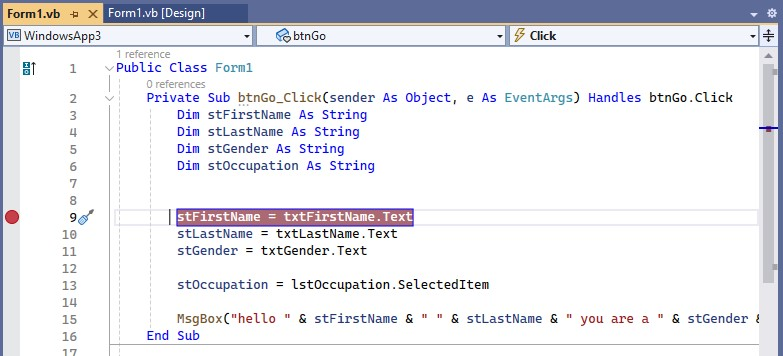
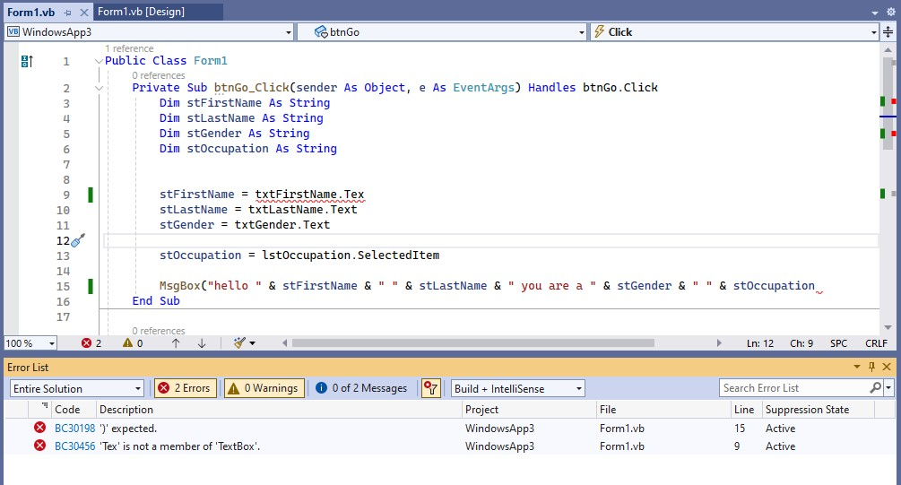

Неофициальный код:  
https://github.com/Kris-fynn/VB.NET/blob/main/OutputAndVariables/Form1.vb

Плэйлист:  
https://www.youtube.com/playlist?list=PLTd6ceoshpremSFQxYM4L0p4Q6hR-4e4J  
https://www.youtube.com/watch?v=XM3mXeTrSeE&list=PLTd6ceoshpremSFQxYM4L0p4Q6hR-4e4J&index=3

Chapters:  

Visual Basic.NET Programming. Beginner Lesson 1. Hello Visual Studio  
Visual Basic.NET Programming. Beginner Lesson 2. Customise The Visual Studio IDE  
Visual Basic.NET Programming. Beginner Lesson 3. Output and Variables  
Visual Basic.NET Programming. Beginner Lesson 4. Variable Data Types  
Visual Basic.NET Programming. Beginner Lesson 5. Input with Windows Forms  
Visual Basic.NET Programming. Beginner Lesson 6. Debugging Code  
Visual Basic.NET Programming. Beginner Lesson 7. Arithmetic Operators  
Visual Basic.NET Programming. Beginner Lesson 8. Complex Arithmetic Expressions  
Visual Basic.NET Programming. Beginner Lesson 9. Selection with If Statements  
Visual Basic.NET Programming. Beginner Lesson 10. Logical and Relational Operators 1  
Visual Basic.NET Programming. Beginner Lesson 11. Logical and Relational Operators 2  
Visual Basic.NET Programming. Beginner Lesson 12. Select Case  
Visual Basic.NET Programming. Beginner Lesson 13. For Next  
Visual Basic.NET Programming. Beginner Lesson 14. Practice For Next Loops & If Blocks  
Visual Basic.NET Programming. Beginner Lesson 15. Do While  
Visual Basic.NET Programming. Beginner Lesson 16. Condition Controlled Loops  
Visual Basic.NET Programming. Beginner Lesson 17. Array Variables  
Visual Basic.NET Programming. Beginner Lesson 18. Practice Arrays & Loops  
Visual Basic.NET Programming. Beginner Lesson 19. Linear Search  
Visual Basic.NET Programming. Beginner Lesson 20. Two Dimensional Arrays  
Visual Basic.NET Programming. Beginner Lesson 21. 2D Arrays & Nested Loops  


## 1. Hello VS

> Создание проекта

В окне приветствия:

-> Create a new project  
-> Выбрать язык в выпадающем списке - Visual Basic  
-> Выбрать прототип - Windows Forms App (.NET Framework)  
-> Next  
-> Выбрать Имя, папку, оставить галочку о совпадении проекта и решения (solution), оставить .NET Framework 4.7.2  
-> Create  


> Код для кнопки

```vb
Public Class Form1

    Private Sub btnStart_Click(sender As Object, e As EventArgs) Handles btnStart.Click

        MsgBox("hello world")
        MsgBox("how are you")
        MsgBox("i hope you are well")

    End Sub

End Class
```

## 2. Customise VS

>    WindowsApp1.sln

Это файл Решений (Solution) проекта в папке проекта. По нему можно запустить проект.

Некоторые настройки VS:

Место проектов меняется в

> Tools - Options - Projects and Solutions - Locations

## 3. Output and Variables

3 фундаментальные конструкции существуют в процедурных языках:  
- последовательность
- выбор
- итерация

Конкатенация:

    &

Варианты написания msgBox:
```vb
MsgBox("welcome to the course")

MessageBox.Show("this is another message")
```

Пример объявления и использования переменных:

```vb
Dim stFirstName As String
Dim stLastName As String

stFirstName = "Kevin"
stLastName = "Drumm"

MsgBox("hello and welcome " & stFirstName & " " & stLastName & " I hope you are well")

stFirstName = "Murvin"
stLastName = "Drake"

MsgBox("hello and welcome " & stFirstName & " " & stLastName & " I hope you are well")
```

Dim - образовано от dimension (выделение памяти).

## 4. Variable Data Types

```vb
 Private Sub btnDataTypes_Click(sender As Object, e As EventArgs) Handles btnDataTypes.Click

     Dim stMake As String
     Dim stModel As String
     Dim iDoors As Integer
     Dim stColour As String
     Dim bTaxed As Boolean
     Dim iEngineSize As Integer
     Dim decPrice As Decimal
     Dim dtDateRegistered As Date

     stMake = "Ford"
     stModel = "Escort"
     iDoors = 5
     stColour = "red"
     bTaxed = True
     iEngineSize = 1200
     decPrice = 999.99
     dtDateRegistered = #11/2/2020#  ' Это 2 ноября, американский формат

     MsgBox("the car is " & stMake & " " & stModel & " " &
            iDoors & " " & stColour & " " & bTaxed & " " &
            iEngineSize & " " & decPrice & " " & dtDateRegistered)

 End Sub
```

Пробелы " " можно заменить константой vbNewLine, которая переносит строки. 

```c#
    # вместо
    & " " &
    # будет
    & vbNewLine &
```

## 5. Input with Windows Forms

Простая процедура для формы, после нажатия на кнопку появится поле ввода:

```vb
    Private Sub btnGo_Click(sender As Object, e As EventArgs) Handles btnGo.Click

        Dim stFirstName As String

        stFirstName = InputBox("please enter your first name")

        MsgBox("hello " & stFirstName)

    End Sub
```

Процедура для формы с тремя полями ввода и кнопкой:

```vb
Private Sub btnGo_Click(sender As Object, e As EventArgs) Handles btnGo.Click

    Dim stFirstName As String
    Dim stLastName As String
    Dim stGender As String

    stFirstName = txtFirstName.Text   'Это значение берётся из текстового поля с названием txtFirstName
    stLastName = txtLastName.Text
    stGender = txtGender.Text

    MsgBox("hello " & stFirstName & " " & stLastName & " you are a " & stGender)

End Sub
```

То же самое, но со списком выбора, List Box

Код кнопки Go
```vb
Private Sub btnGo_Click(sender As Object, e As EventArgs) Handles btnGo.Click
    
    Dim stFirstName As String
    Dim stLastName As String
    Dim stGender As String
    Dim stOccupation As String

    stFirstName = txtFirstName.Text
    stLastName = txtLastName.Text
    stGender = txtGender.Text

    stOccupation = lstOccupation.SelectedItem  'Это значение берётся из поля списка с названием lstOccupation

    MsgBox("hello " & stFirstName & " " & stLastName & " you are a " & stGender & " " & stOccupation)

End Sub
```

То же самое, но с добавлением в список выбора еще трех элементов через загрузку формы (своего рода конструктор при инициализации формы). Список будет добавлен в выбор опций, когда форма загрузится.  


Код формы
```vb
Private Sub Form1_Load(sender As Object, e As EventArgs) Handles MyBase.Load

    'Эти значения будут автоматически добавлены
    'в поле списка при загрузке формы
    lstOccupation.Items.Add("Writer") 
    lstOccupation.Items.Add("Actor")
    lstOccupation.Items.Add("Painter")

End Sub
```

## 6. Debugging Code

### Breakpoints

Установка точки останова  



Кнопки управления:  


Различные окна, такие как `Output`, доступны в меню `Debug -> Windows`. Некоторые из них, такие как `Locals` (локальные переменные), могут стать доступны после выполения некоторых точек останова.

### Syntax Error  

Выявление ошибок после запуска  



## 7. Arithmetic Operators

```vb
Private Sub btnCalculate_Click(...)...

    Dim iNumber1 As Integer
    Dim iNumber2 As Integer

    Dim iResult As Integer

    iNumber1 = txtNumber1.Text
    iNumber2 = txtNumber2.Text

    iResult = iNumber1 / iNumber2 'при Integer выдаст целое число 
    MsgBox(iResult)

End Sub
```

```vb
Private Sub btnCalculate_Click(...)...

    Dim dblNumber1 As Double
    Dim dblNumber2 As Double

    Dim dblResult As Double

    dblNumber1 = txtNumber1.Text
    dblNumber2 = txtNumber2.Text

    dblResult = dblNumber1 + dblNumber2
    MsgBox(dblResult)

    dblResult = dblNumber1 - dblNumber2
    MsgBox(dblResult)

    dblResult = dblNumber1 * dblNumber2
    MsgBox(dblResult)

    dblResult = dblNumber1 / dblNumber2
    MsgBox(dblResult)

    dblResult = dblNumber1 ^ dblNumber2  'возведение в степень
    MsgBox(dblResult)

    dblResult = dblNumber1 \ dblNumber2  'целочисленное деление
    MsgBox(dblResult)

    dblResult = dblNumber1 Mod dblNumber2  'остаток от деления
    MsgBox(dblResult)
End Sub
```

При арифметических операциях из текстовых полей VB преобразует вводимые числа из строкового типа в числовой.  

## 8. Complex Arithmetic Expressions

```vb
 Private Sub btnCalculate_Click(sender As Object, e As EventArgs) Handles btnCalculate.Click
     Dim decPrice As Decimal
     Dim iQuantity As Integer
     Dim decDiscount As Decimal
     Dim decTotalCost As Decimal
     Dim decPostage As Decimal

     decPrice = 5
     iQuantity = 10
     decDiscount = 2
     decPostage = 3

     decTotalCost = ((decPrice - decDiscount) * iQuantity) + decPostage

     MsgBox(decTotalCost)

     Dim iResult As Integer
     iResult = 10 - 5 + 2
     MsgBox(iResult)

     iResult = 10 + 2 - 5
     MsgBox(iResult)

     iResult = 10 - 2 + 5
     MsgBox(iResult)


     iResult = 10 / 5 * 2
     MsgBox(iResult)

     iResult = 2 * 10 / 5
     MsgBox(iResult)

     iResult = 10 * 5 / 2
     MsgBox(iResult)

 End Sub
```

## 9. Selection with If Statements

3 фундаментальные конструкции существуют в процедурных языках:  
- последовательность
- выбор
- итерация

Здесь рассказывается о Выборе.

В VB одиночное равно (=) используется и для присваивания, и для проверки на равенство.

Однострочный if

```vb
 Dim stCountry As String
 stCountry = txtCountry.Text

 If stCountry = "Australia" Then MsgBox("G'day mate")
```

Многострочный if

```vb
 Private Sub btnGreet_Click(sender As Object, e As EventArgs) Handles btnGreet.Click
     Dim stCountry As String
     stCountry = txtCountry.Text

     If stCountry = "Australia" Then
         MsgBox("G'day mate")
         MsgBox("Good on ya")
         MsgBox("No worries")
     End If
 End Sub
```

ElseIf

```vb
Private Sub btnGreet_Click(sender As Object, e As EventArgs) Handles btnGreet.Click
    Dim stCountry As String
    stCountry = txtCountry.Text

    If stCountry = "Australia" Then
        MsgBox("G'day mate")
        MsgBox("Good on ya")
        MsgBox("No worries")
    ElseIf stCountry = "France" Then
        MsgBox("Bonjour")
        MsgBox("Comment allez-vous?")
    End If
End Sub
```

Несколько ElseIf и один Else

```vb
Private Sub btnGreet_Click(sender As Object, e As EventArgs) Handles btnGreet.Click
    Dim stCountry As String
    stCountry = txtCountry.Text

    If stCountry = "Australia" Then
        MsgBox("G'day mate")
        MsgBox("Good on ya")
        MsgBox("No worries")
    ElseIf stCountry = "France" Then
        MsgBox("Bonjour")
        MsgBox("Comment allez-vous?")
    ElseIf stCountry = "Japan" Then
        MsgBox("Konnichiwa")
        MsgBox("Choushi wa dou desu ka")
    Else
        MsgBox("Hello there")
        MsgBox("I hope, you are well")
    End If
End Sub
```

If чувствительны к регистру.  
Можно убрать чувствительность к регистру тем, что в переменную всегда будут попадать преобразованные буквы в верхнем регистре.  

```vb
 Dim stCountry As String
 stCountry = txtCountry.Text
 stCountry = stCountry.ToUpper
 'введённые буквы будут преобразованы в верхний регистр

 If stCountry = "AUSTRALIA" Then
     MsgBox("G'day mate")
     MsgBox("Good on ya")
     MsgBox("No worries")
 ElseIf stCountry = "FRANCE" Then
     MsgBox("Bonjour")
     MsgBox("Comment allez-vous?")
 ElseIf stCountry = "JAPAN" Then
     MsgBox("Konnichiwa")
     MsgBox("Choushi wa dou desu ka")
 Else
     MsgBox("Hello there")
     MsgBox("I hope, you are well")
 End If
```

Вариант - не перезаписывать введённую пользователем переменную, т.к. она может понадобиться далее в коде, а преобразовывать её только для If тестов.  

```vb
 Dim stCountry As String
 stCountry = txtCountry.Text

 If stCountry.ToUpper = "AUSTRALIA" Then
 ' частное преобразование
     MsgBox("G'day mate")
     MsgBox("Good on ya")
     MsgBox("No worries")
 ElseIf stCountry.ToUpper = "FRANCE" Then
 ' частное преобразование
     MsgBox("Bonjour")
     MsgBox("Comment allez-vous?")
 ElseIf stCountry.ToUpper = "JAPAN" Then
 ' частное преобразование
     MsgBox("Konnichiwa")
     MsgBox("Choushi wa dou desu ka")
 Else
     MsgBox("Hello there")
     MsgBox("I hope, you are well")
 End If

 MsgBox("You entered " & stCountry)
 ' изначально введённая пользователем переменная
```

## 10. Logical and Relational Operators 1

```vb
Private Sub btnGrade_Click(sender As Object, e As EventArgs) Handles btnGrade.Click

    Dim iScore As Integer
    iScore = txtExamScore.Text

    If iScore < 0 Or iScore > 100 Then
        MsgBox("That is not a valid score. Enter a number between 0 and 100")
        Exit Sub ' Останавливает программу здесь
    End If

    MsgBox("all done")

End Sub
```

```vb
    Dim iScore As Integer
    iScore = txtExamScore.Text

    If iScore < 0 Or iScore > 100 Then
        MsgBox("That is not a valid score. Enter a number between 0 and 100")
        Exit Sub ' Останавливает программу здесь
    End If

    If iScore >= 50 Then
        MsgBox("pass")
    End If

    If iScore < 50 Then
        MsgBox("fail")
    End If

    MsgBox("all done")
```
Однако в этом варианте программа проходит все блоки If, даже если какие-то из них избыточны, если нужное значение уже найдено. Поэтому лучше использовать блоки с If .. ElseIf .  

```vb
Dim iScore As Integer
iScore = txtExamScore.Text

If iScore < 0 Or iScore > 100 Then
    MsgBox("That is not a valid score. Enter a number between 0 and 100")
ElseIf iScore >= 50 Then
    MsgBox("pass")
ElseIf iScore < 50 Then
    MsgBox("fail")
End If

MsgBox("all done")
```

Проверка на невалидные данные, текст вместо числа.

```vb
 Dim iScore As Integer

 ' Если при приведении к числу, всё хорошо, то продолжаем присвоение.
 ' IsNumeric не преобразует в число, а спрашивает, можно ли преобразовать в число.
 If IsNumeric(txtExamScore.Text) = True Then
    ' и дополнительно вводим приведение типа,
    ' преобразовать в целое число,
    ' т.к. по умолчанию из поля ввода даже цифры приходят как текст
    iScore = CInt(txtExamScore.Text)
 Else
     ' Иначе остановим программу
     MsgBox("You must enter a number")
     Exit Sub
 End If

 If iScore < 0 Or iScore > 100 Then
     MsgBox("That is not a valid score. Enter a number between 0 and 100")
 ElseIf iScore >= 50 Then
     MsgBox("pass")
 ElseIf iScore < 50 Then
     MsgBox("fail")
 End If

 MsgBox("all done")
```

## 11. Logical and Relational Operators 2

```vb
Private Sub btnGrade_Click(sender As Object, e As EventArgs) Handles btnGrade.Click

    Dim iScore As Integer

    ' Если при приведении к числу, всё хорошо, то продолжаем присвоение.
    ' IsNumeric не преобразует в число, а спрашивает, можно ли преобразовать в число.
    If IsNumeric(txtExamScore.Text) = True Then
        ' и дополнительно вводим приведение типа,
        ' преобразовать в целое число,
        ' т.к. по умолчанию из поля ввода даже цифры приходят как текст
        iScore = CInt(txtExamScore.Text)
    Else
        ' Иначе остановим программу
        MsgBox("You must enter a number")
        Exit Sub
    End If

    ' Использование Not и And 
    If Not (iScore >= 0 And iScore <= 100) Then
        MsgBox("That is not a valid score. Enter a number between 0 and 100")
    ElseIf iScore <= 20 Then
        MsgBox("GRADE F")
    ElseIf iScore > 20 And iScore <= 30 Then
        MsgBox("GRADE E")
    ElseIf iScore > 30 And iScore <= 40 Then
        MsgBox("GRADE D")
    ElseIf iScore > 40 And iScore <= 50 Then
        MsgBox("GRADE C")
    ElseIf iScore > 50 And iScore <= 70 Then
        MsgBox("GRADE B")
    Else
        MsgBox("GRADE A")
    End If

    MsgBox("all done")

End Sub
```

## 12 Select Case

```vb
    Private Sub btnCheck_Click(sender As Object, e As EventArgs) Handles btnCheck.Click
        Dim iTemperature As Integer
        ' присвоение и преобразование типа в integer
        iTemperature = CInt(txtTemperature.Text)

        Dim iWindSpeed As Integer
        iWindSpeed = 30

        'If может проверить несколько переменных за раз

        'If iTemperature <= 0 And iWindSpeed > 20 Then
        '    MsgBox("That will feel really cold")
        'End If

        'Case проверяет только одну переменную за раз
        Select Case iTemperature
            Case Is = 0
                MsgBox("Freezing")
                MsgBox("Water will freeze")
                MsgBox("and you can go skating")
            Case Is < 0
                MsgBox("Sub zero")
                'If можно вкладывать в конструкцию Case
                If iWindSpeed > 20 Then
                    MsgBox("That will feel really cold")
                End If
            Case 1 To 10    '1 и 10 включительно
                MsgBox("Cold")
            Case 11, 12, 13, 14, 15, 16, 17, 18, 19, 20
                MsgBox("Warm")
            Case Else
                MsgBox("Hot")
        End Select

    End Sub
```

## 13. For Next

Простые циклы

```vb
    Dim iCount As Integer

    ' Цикл будет повторяться 5 раз
    For iCount = 1 To 5
        MsgBox("hello")
        MsgBox("how are you")
        MsgBox("well I hope")
    Next

    For iCount = 1 To 5
        MsgBox("hello " & iCount)
    Next

    ' Издать звуковой сигнал Windows
    For iCount = 1 To 5
        Beep()
        ' Пауза 3 секунды
        Threading.Thread.Sleep(3000)
    Next
```

Цикл с шагом выполнения 5 

```vb
    Dim iCount As Integer

    ' Цикл будет повторяться 50 раз, но с шагом выполнения 5
    For iCount = 0 To 50 Step 5
        MsgBox(iCount)
    Next
```

Цикл со счётом в обратном порядке 

```vb
    Dim iCount As Integer

    ' Цикл будет повторяться 50 раз в обратном порядке, но с шагом выполнения 5
    For iCount = 50 To 0 Step -5
        MsgBox(iCount)
    Next
```

Цикл со сборным сообщением в одном окне

```vb
    ' Вывести все сообщения в одном окне
    For iCount = 50 To 0 Step -5
        ' Сбор всех данных в одну строку в цикле,
        ' приращение на подобие var.=
        stOut = stOut & iCount & vbNewLine
    Next

    MsgBox(stOut)
```

## 


