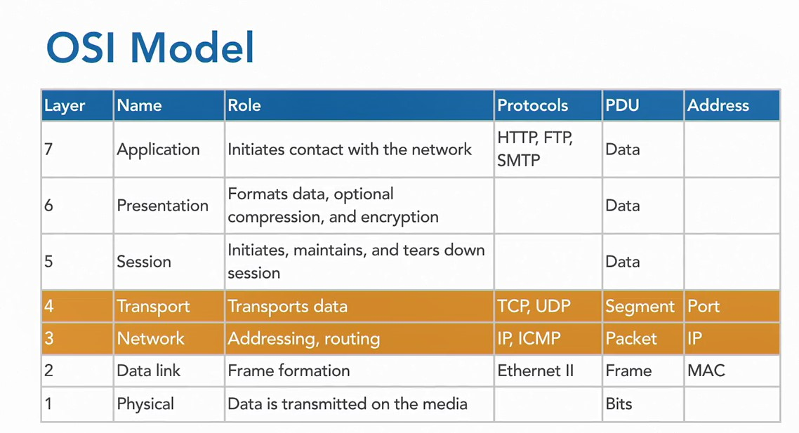
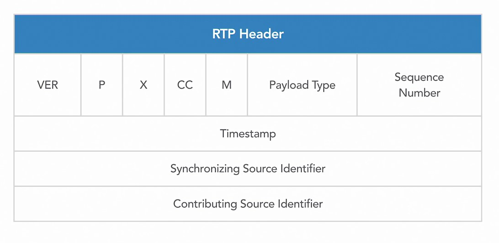

## 8. TCP/IP

TCP/IP на схеме OSI

## 009-DHCP

Сервер DHCP раздаёт пул ip-адресов на устройства.  

## 010-Real Time Transport Protocol

RTP Заголовки

https://www.cloudshark.org/captures/4ff29b39b8dc  
https://www.cloudshark.org/captures/4ff29b39b8dc?filter=rtp  

## 011-Real Time Control Protocol

https://www.cloudshark.org/captures/4ff29b39b8dc 

Протокол управления в реальном времени RTCP является вспомогательным протоколом к RTP, который пассивно собирает статистику.  
Отчеты присылают все участники для предоставления контрольной информации и статистики для потока RTP, это 
- Sender Report
- Receiver Report
- Source description  

## 012-Skinny Client Control Protocol SCCP

Это - протокол CISCO для ip-телефонов. Похож на SIP и H.323.

Использование портов:

https://speedguide.net/ports.php  
https://speedguide.net/port.php?port=16384    

Этот протокол можно преобразовать в RTP внутри Wireshark (Decode As... RTP), чтобы затем визуализировать и услышать поток (Play Stream).
   
---

