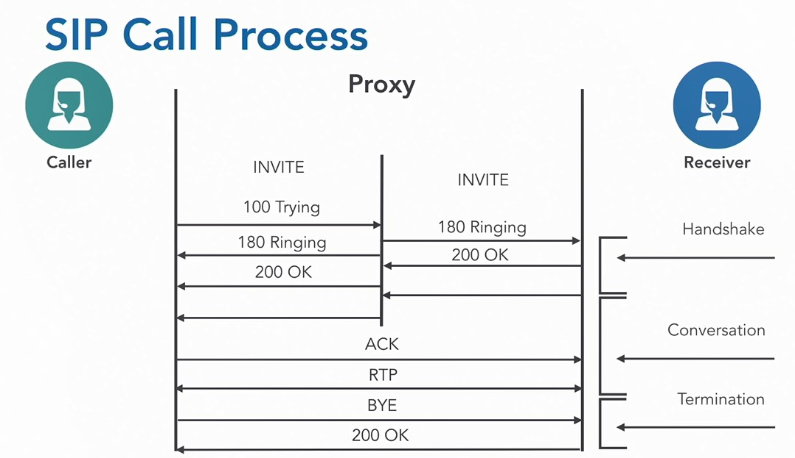

## 013-Gateways and gatekeepers

## 014-Understanding MGCP and Megaco H.248

Расшифровка некоторых команд:  
https://ine.com/blog/2012-01-25-troubleshooting-voice-mgcp

Снимки Wiresahrk  
https://github.com/goffinet/sip_captures  
https://github.com/goffinet/sip_captures/blob/master/sip.pcapng  

## 015-Session Initiation Protocol

https://wiki.wireshark.org/  
https://wiki.wireshark.org/SampleCaptures  
https://wiki.wireshark.org/SampleCaptures#sip-and-rtp  

Фильтр в Wireshark

    sip || rtp

## 016-H.323 family

H.323 - более старый аналог SIP. Он служит оболочкой для протоколов H.225 и H.245.

## 017-Establishing an H.323 connection

H.323 Call Setup

Пример:

    https://wiki.wireshark.org/SampleCaptures

    General / Unsorted

    rtp_example.raw.gz (libpcap) A VoIP sample capture of a H323 call (including H225, H245, RTP and RTCP)

## 018-Evaluating H.323

---
