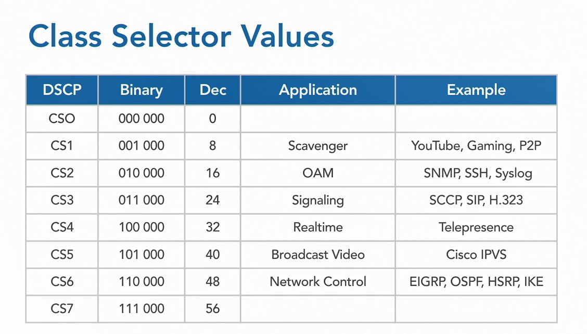
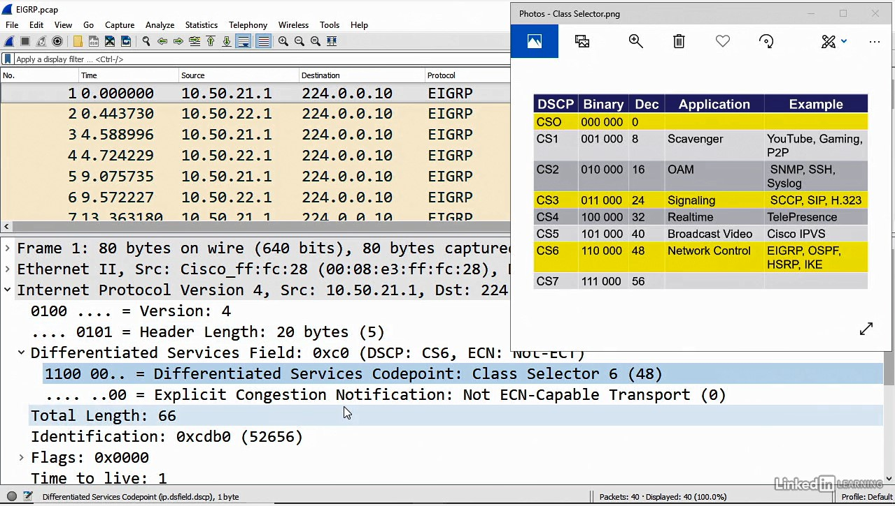
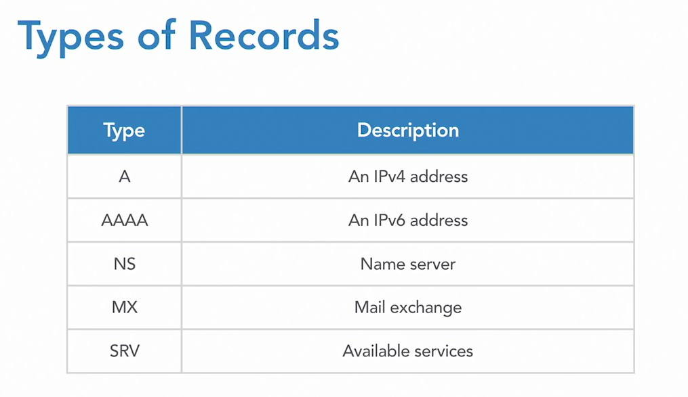
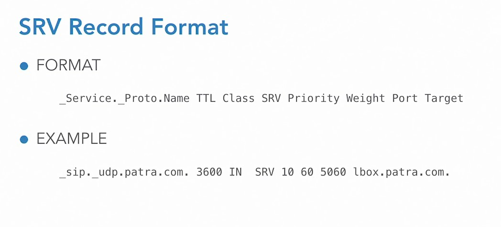
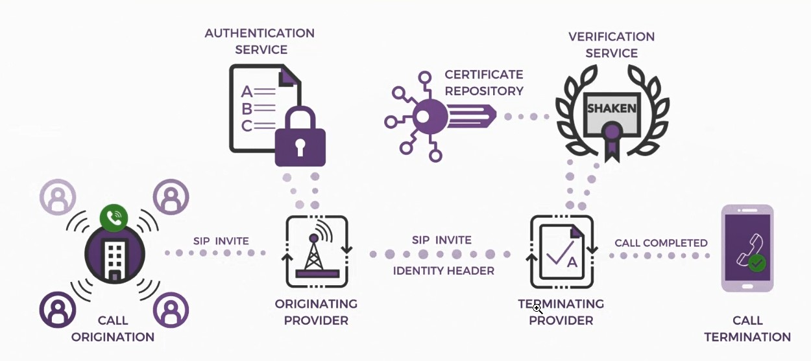

## 019-Performance overview

## 020-Quality of service

Уровень ("Терпимость") пропускания трафика.

https://datatracker.ietf.org/doc/html/rfc791 [Page 12]  

Таблица Class Selector values.

Class Selector values in Wireshark.

## 021-Domain Name System

Типы ресурсов  

SRV Record

## 022-Directory integration

## 023-Using STIR SHAKEN to reduce robocalls

STIR/SHAKEN - решение, разработанное для отмены подделки номеров и звонков от роботов, используемых мошенниками при звонке.  

STIR (Secure Telephony Identity Revisited) - это тип цифровой подписи для звонка, который проверяет личность звонящего.   

SHAKEN (Secure Handling of Asserted Information using toKENs) - это стандарты того, как провайдер развёртывает STIR.  

Пример защищённой обработки звонка по технологии STIR/SHAKEN  

---