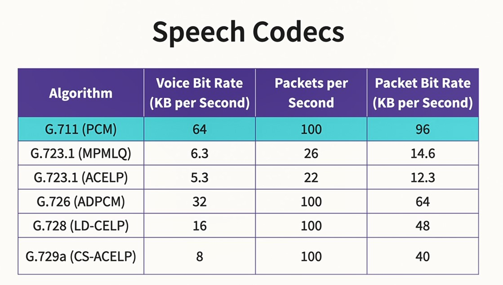
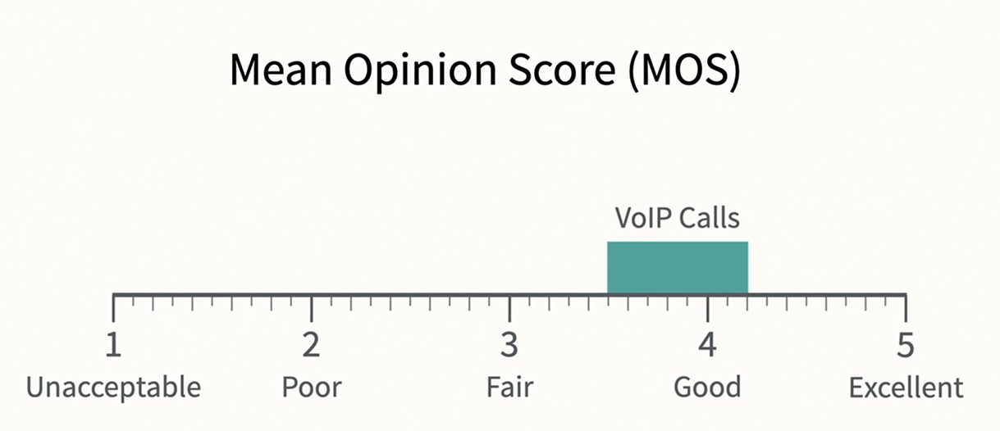
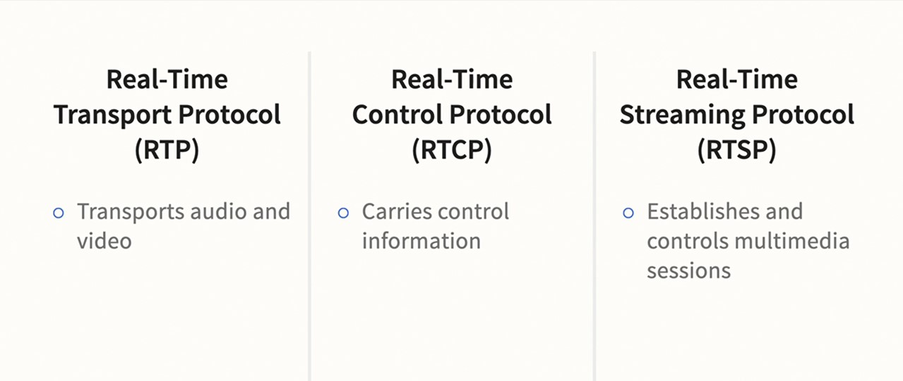
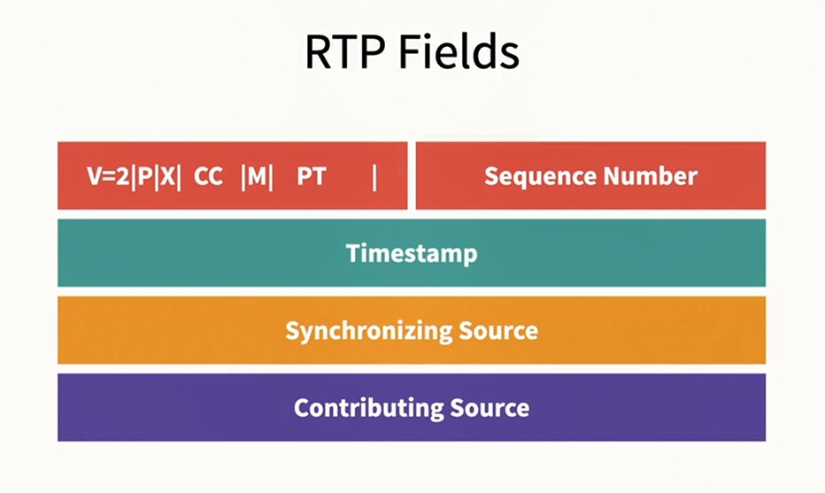
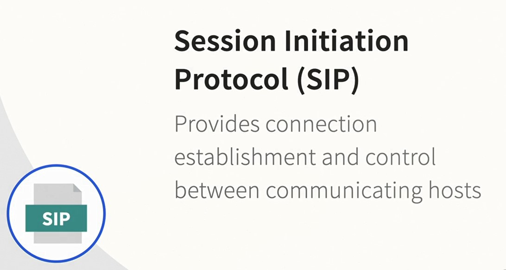
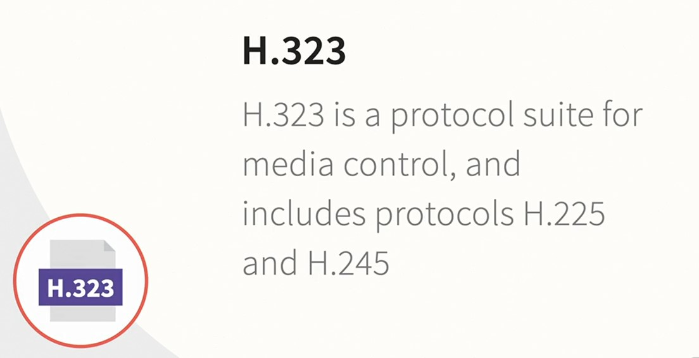

## 009-Voice signal conversion with digital codecs

Звук, который слышит человек: 20 -20000 Гц.  
Речь, которая распознаётся человеком: 300 - 3300 Гц. Он слышится приглушённым, но разборчивым. Так слышится уже оцифрованная речь (Voip) в телефонной трубке.  

Кодеки преобразуют аналоговый сигнал в цифровой.  

Качество передаваемого голоса оценивается по следующей шкале. Большинство звонков подпадает под оценку 3,5-4,2   

## 010-Data transportation using real time protocols

Протоколы RTP

RTP заголовки и поля

Протоколы установления сеанса  

---