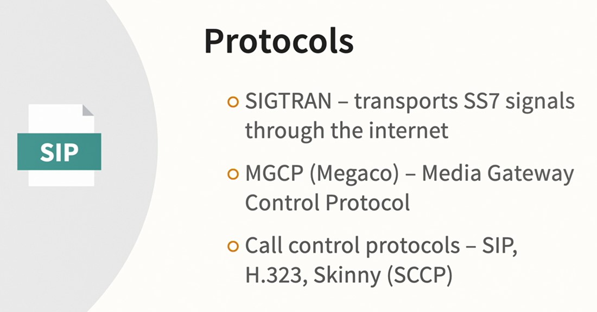
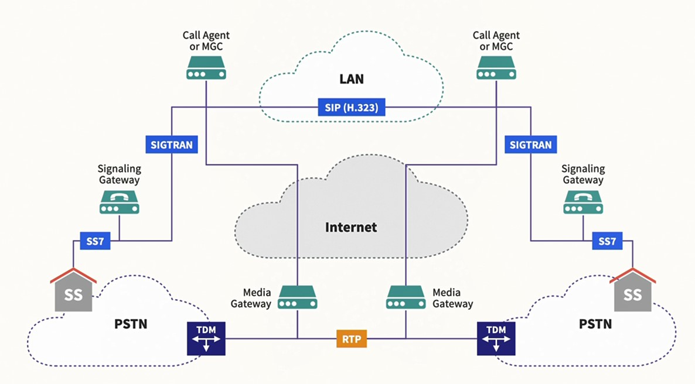
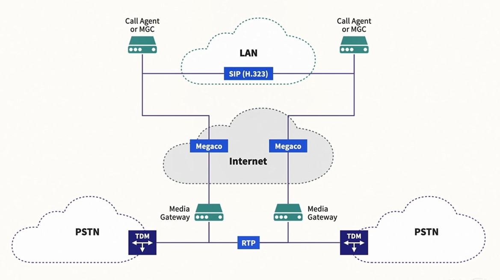
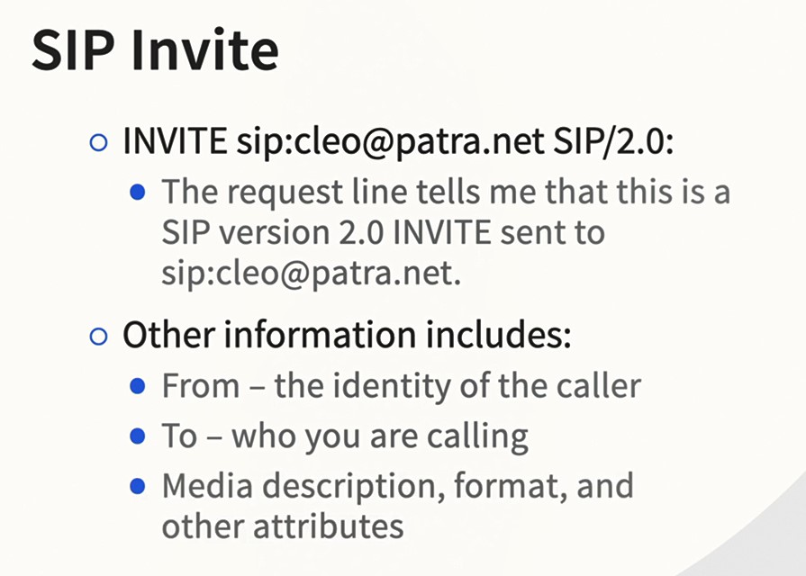
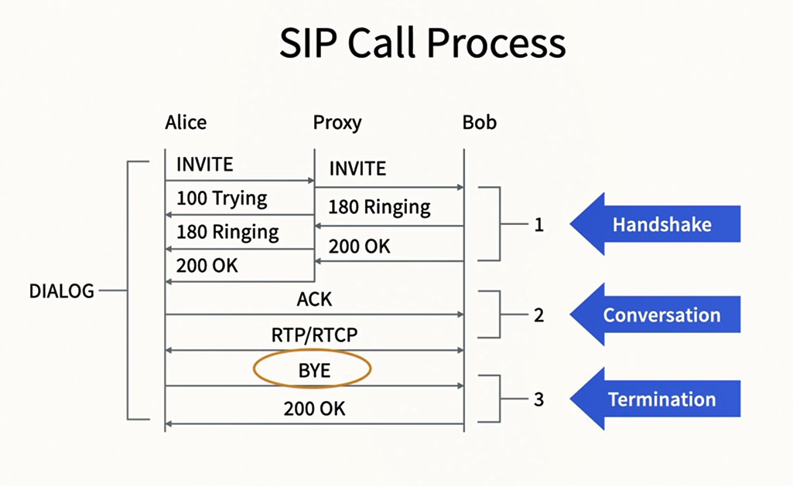
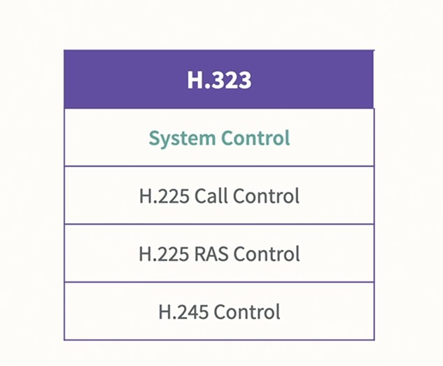
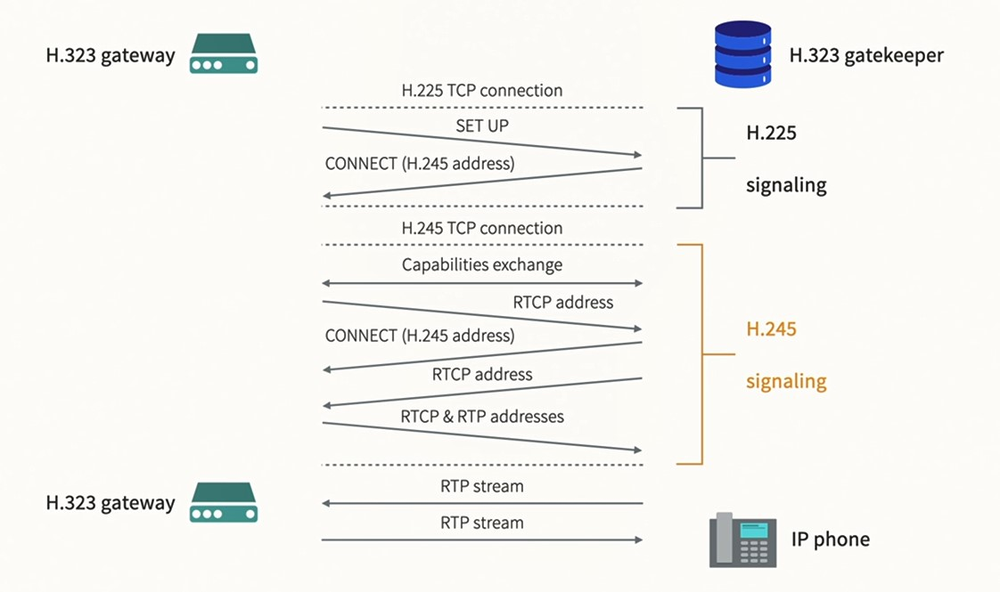

## 011-Passing telephony data through gateways

Протоколы передачи данных

Схема протоколов и шлюзов между Телефонной Сетью Общего Пользования (PSTN, старая аналоговая сеть) и Интернетом с Voip

## 012-Understanding MGCP Megaco (H.248)

Megaco == H.248

## 013-Session Initiation Protocol SIP

SIP, его предшественник H.323. 

## 014-The H.323 wrapper H.225 and H.245

Рекомендация:  

https://www.itu.int/rec/T-REC-H.323/e

H.323 включает в себя H.225 и H.245  

h323-include

h323-path

## 015-Translators and mixers

Трансляторы и микшеры - это промежуточные устройства размещаемые в сети, которые преобразуют медиапоток в течение сеанса.  
Типы трансляторов:  
- мосты         - не меняют кодировку
- транскодеры   - меняют кодировку
- эксплодеры    - размножают пакеты для отправки нескольким адресатам
- мерджеры      - соединяют дублирующиеся пакеты в один

Микшеры смешивают несколько потоков от сети с большой пропускной способностью в один поток в сеть с малой пропускной способностью.  

---

