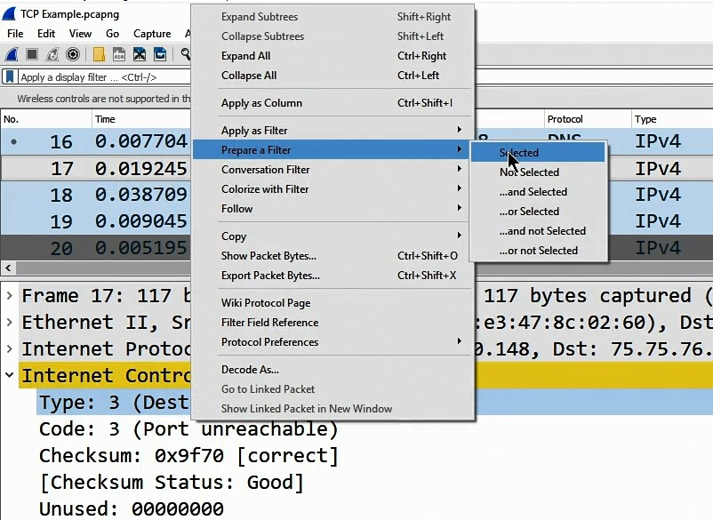
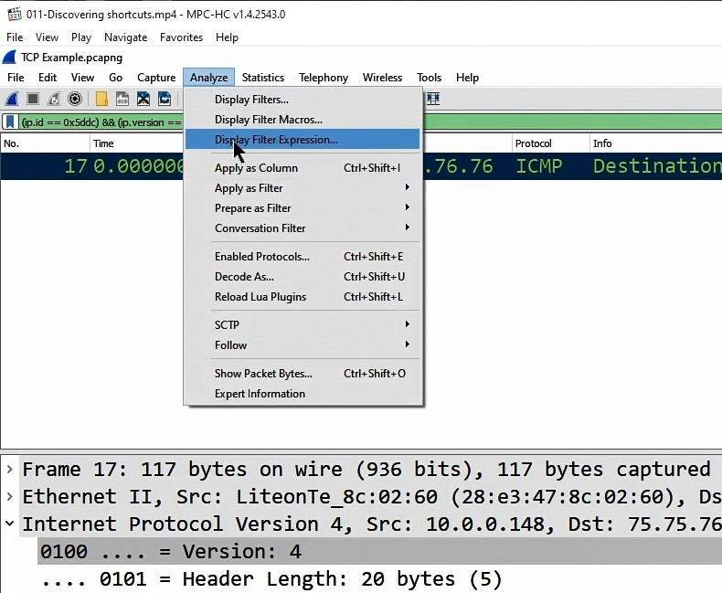

# 2. Getting Started with Wireshark

## 010-Using display and capture filters

### Примеры фильтров

Верхний - Display filter

    ftp

Нижний - Capture filter

    tcp port 21

Полезные меню:

> Statistics - Flow Graph

## 011-Discovering shortcuts

prepare_filter_selected

Result

Для получения результата надо нажать Enter в строке фильтра.

prepare_filter_and_selected

Result

Analyze - Display Filter Expr

Result

## 012-Grasping the OSI model

Соотношение пакетов с моделью OSI in Wireshark:

## 013-Generating a frame

FCS - это frame check sequence, проверка целостности кадра (фрейма).

Не все фреймы имеют данные (Data).

---