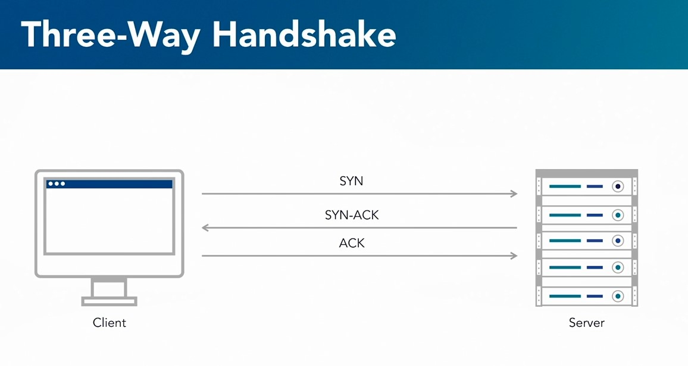
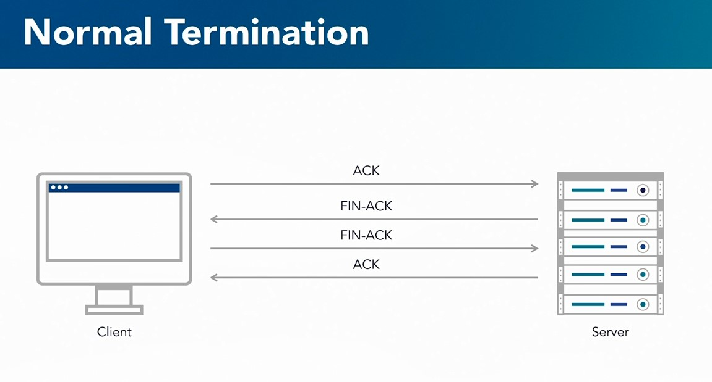

## 016-Understanding the TCP IP suite

## 017-Explaining Transmission Control Protocol

https://www.cloudshark.org/captures/0012f52602a3

## 018-Recognizing the TCP connection process

Трехстороннее рукопожатие TCP

Нормальное завершение TCP

## 019-Viewing the TCP handshake and teardown

https://www.cloudshark.org/captures/923901f326f8

## 020-Breaking down User Datagram Protocol

https://www.cloudshark.org/captures/00089db884f6

## 021-Outlining IPv4

## 022-Dissecting IPv6

