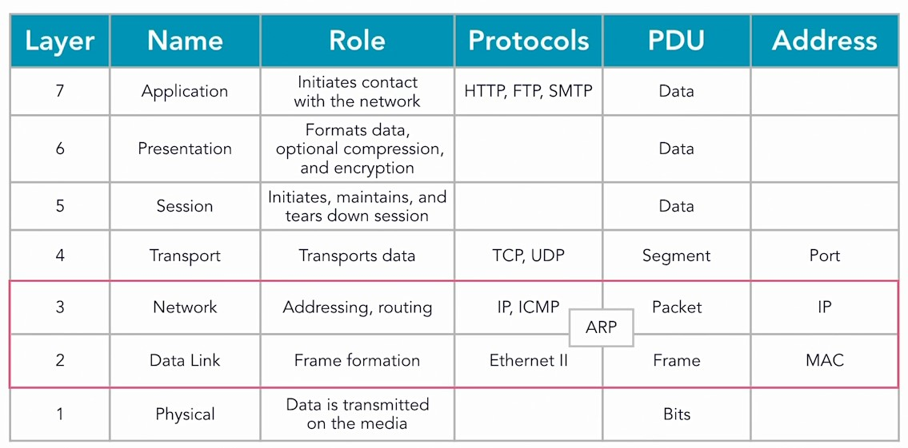

## 027-Dissecting DNS

https://www.statdns.com/rfc/

## 028-Exploring DHCP

DHCP-сервер - автоматически раздаёт IP-адреса в локальной сети.

## 029-Following an FTP transaction

Проследить коды ответов пакета FTP можно щёлкнув правой кнопокой на пакете, далее Follow - TCP Stream.  

## 030-Using HTTP

## 031-Understand ARP (Address Resolution Protocol)

ARP преобразует IP-адрес в локальной сети в MAC-адрес.

Если в анализе Wireshark встретится `Gratuitos ARP`, то он отвечает за проверку дублирующихся IP-адресов.  

## 033-Solution Examining a packet capture

OCSP-Good.cap  
https://www.cloudshark.org/captures/00089db884f6

(не найден - 404)  
https://www.cloudshark.org/captures/c109b95db0af

ftp.pcap  
https://www.cloudshark.org/captures/abdc8742488f

---
