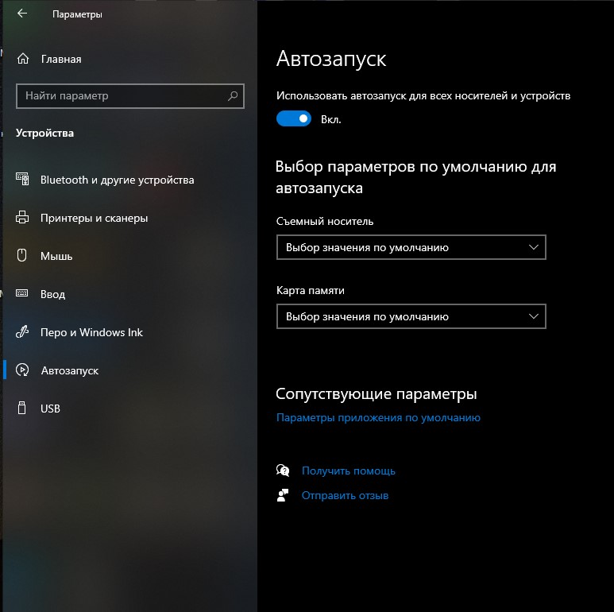

## 027-Move and copy files

Копирование папок (файлов) в другую папку возможно при перетаскивании и зажатии кнопки Ctrl.  

## 028-Delete files and folders

Обратное перетаскивание из корзины тоже работает.  

## 029-Zip and unzip archive files

В проводнике Поделиться-Сжать создаёт zip-архив из выбранных файлов.  

## 031-Use an external drive or memory stick

Настройка автозапуска USB:  

USB в Windows 10 можно выдергивать без предварительного отключения в  системе.  

## 
